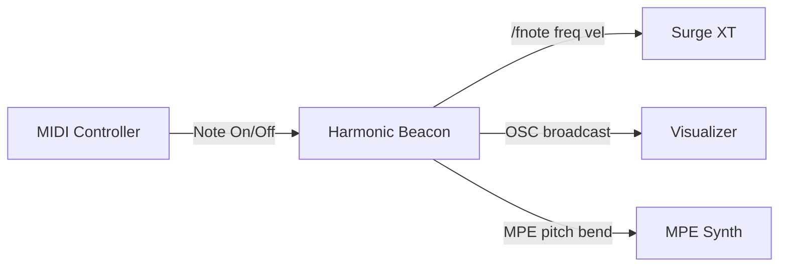

# Introduction

The Harmonic Beacon is a real-time MIDI middleware that transforms a standard
keyboard into a portal to the natural harmonic series. Where conventional
instruments divide the octave into twelve equal semitones -- a compromise
forged in the eighteenth century -- the Beacon recovers the infinite continuum
of harmonic relationships that exist in nature.

This is a literate program: the document you are reading *is* the source code.
Every Python file in the `harmonic_beacon/` package is woven into this
narrative in **psychological order** -- the order that best explains the
system to a human reader, not the order the compiler demands.

The Harmonic Beacon is one of two experimental probes for
**Harmonic Information Theory (HIT)** -- the hypothesis that some harmonic
organizations can function as informational constraints, making structure
more detectable and reducing descriptive load. While *Phideus* explores this
computationally, the Beacon explores it *experientially*: by playing the
natural harmonic series, the musician directly encounters the ratios that
HIT proposes are fundamental to information.

## Architecture at a Glance



## Module Order

| # | Module | Role |
|---|--------|------|
| 1 | `__init__.py` | Package marker |
| 2 | `harmonics.py` | The mathematics of natural harmonics |
| 3 | `config.py` | All configuration constants |
| 4 | `key_mapper.py` | Maps MIDI keys to harmonic numbers |
| 5 | `midi_handler.py` | Receives MIDI events from hardware |
| 6 | `polyphony.py` | Tracks active notes and voice IDs |
| 7 | `lfo.py` | Harmonic chorus sweep effect |
| 8 | `osc_sender.py` | Sends frequencies to Surge XT via OSC |
| 9 | `mpe_sender.py` | MPE output for microtonal control |
| 10 | `main.py` | The orchestrator that ties everything together |

# The Package

The Harmonic Beacon is a Python package. This is its marker file -- it
declares the version and nothing more.

```python {chunk="init" file="harmonic_beacon/__init__.py"}
"""The Harmonic Beacon - Natural Harmonic Series MIDI Middleware."""

__version__ = "0.1.0"
```

# The Mathematics of Natural Harmonics

At the heart of the Harmonic Beacon lies a simple equation from physics.
When a string vibrates, it produces not just its fundamental frequency but
a series of overtones at integer multiples:

$$f_n = f_1 \times n$$

where $f_1$ is the fundamental frequency and $n = 1, 2, 3, \ldots$ is the
harmonic number.

## The Cent Scale

Musicians measure pitch intervals in **cents**, where 1200 cents = 1 octave.
The cent distance of harmonic $n$ from the fundamental is:

$$\text{cents}(n) = 1200 \times \log_2(n)$$

## The Code

```python {chunk="harmonics" file="harmonic_beacon/harmonics.py"}
"""Harmonic series calculations and frequency mapping.

This module implements the mathematical core of The Harmonic Beacon,
mapping MIDI notes to the Natural Harmonic Series.
"""

import math

# Harmonic lookup table: MIDI key offset (0-11) → Harmonic number (n)
# Based on the spec's 12-key octave mapping
HARMONIC_MAP: dict[int, int] = {
    0: 1,    # C  → Fundamental (1/1)
    1: 17,   # C# → Minor Second (17/16)
    2: 9,    # D  → Major Second (9/8)
    3: 19,   # Eb → Harmonic minor 3rd (19/16)
    4: 5,    # E  → Major Third (5/4)
    5: 21,   # F  → Narrow Fourth (21/16)
    6: 11,   # F# → Mystic Tritone (11/8)
    7: 3,    # G  → Perfect Fifth (3/2)
    8: 13,   # Ab → Harmonic minor 6th (13/8)
    9: 27,   # A  → Major Sixth (27/16)
    10: 7,   # Bb → Harmonic Seventh (7/4)
    11: 15,  # B  → Major Seventh (15/8)
}

# Interval names for display/debugging
INTERVAL_NAMES: dict[int, str] = {
    0: "Fundamental",
    1: "Minor Second",
    2: "Major Second",
    3: "Harmonic m3",
    4: "Major Third",
    5: "Narrow Fourth",
    6: "Mystic Tritone",
    7: "Perfect Fifth",
    8: "Harmonic m6",
    9: "Major Sixth",
    10: "Harmonic Seventh",
    11: "Major Seventh",
}

# Reference for MIDI note to frequency conversion
MIDI_A4 = 69
FREQ_A4 = 440.0

# Maximum harmonic frequency (hearing limit)
MAX_HARMONIC_FREQ = 20000.0


def get_harmonic_number(midi_note: int) -> int:
    """Map a MIDI note number to its corresponding harmonic number (12-key mode).
    
    DEPRECATED: Use get_harmonic_for_key() for full 88-key support.
    
    Args:
        midi_note: Absolute MIDI note number (0-127)
        
    Returns:
        The harmonic number (n) from the fixed 12-interval table
    """
    key_offset = midi_note % 12
    return HARMONIC_MAP[key_offset]


def get_harmonic_for_key(
    midi_note: int, 
    anchor_note: int = 24,
    cents_threshold: float = 25.0,
) -> int:
    """Calculate the harmonic for any key position (88-key hybrid mode).
    
    Uses a two-tier approach:
    1. If the key lands close to a pure harmonic (within cents_threshold),
       use that harmonic directly.
    2. Otherwise, fall back to the 12-interval table for the key's
       chromatic position.
    
    Args:
        midi_note: MIDI note number (0-127)
        anchor_note: MIDI note that represents f₁ (default: 24 = C1)
        cents_threshold: Maximum cents deviation to count as "exact" (default: 25)
        
    Returns:
        Harmonic number (n ≥ 1)
        
    Examples:
        >>> get_harmonic_for_key(36, anchor=24)  # C2 lands exactly on n=2
        2
        >>> get_harmonic_for_key(59, anchor=24)  # B3 doesn't land exactly, uses table
        15
    """
    semitones = midi_note - anchor_note
    
    # Calculate the exact harmonic position
    n_exact = 2 ** (semitones / 12)
    # Use floor (int) instead of round() for left-aligned mapping
    n_nearest = max(1, int(n_exact))
    
    # Calculate cents deviation from the nearest harmonic
    if n_nearest > 0:
        perfect_semitones = 12 * math.log2(n_nearest)
        cents_error = abs(semitones - perfect_semitones) * 100
    else:
        cents_error = float('inf')
    
    # If close to a pure harmonic, use it directly
    if cents_error <= cents_threshold:
        return n_nearest
    
    # Otherwise, fall back to the 12-interval table
    # This preserves the musical character of each chromatic position
    return HARMONIC_MAP[midi_note % 12]


def get_harmonic_info(
    midi_note: int, 
    anchor_note: int = 24,
    cents_threshold: float = 25.0,
) -> dict:
    """Get detailed harmonic information for a key.
    
    Args:
        midi_note: MIDI note number (0-127)
        anchor_note: MIDI note that represents f₁
        cents_threshold: Threshold for "exact" harmonic landing
        
    Returns:
        Dictionary with harmonic details including whether it's a direct
        harmonic landing or an interval fallback.
    """
    semitones = midi_note - anchor_note
    # Calculate the exact harmonic position
    n_exact = 2 ** (semitones / 12)
    # Use floor (int) instead of round() for left-aligned mapping
    n_nearest = max(1, int(n_exact))
    
    # Calculate cents deviation from the nearest harmonic
    if n_nearest > 0:
        perfect_semitones = 12 * math.log2(n_nearest)
        cents_error = (semitones - perfect_semitones) * 100
    else:
        cents_error = 0.0
    
    is_direct = abs(cents_error) <= cents_threshold
    
    if is_direct:
        n_used = n_nearest
        source = "direct"
    else:
        # For fallback, we also want to align to the floor of the interval
        # But HARMONIC_MAP is 12-tone, so this stays as chromatic lookup
        # The key logic change is mainly for the "direct" hit detection above
        n_used = HARMONIC_MAP[midi_note % 12]
        source = "interval"
    
    return {
        "midi_note": midi_note,
        "harmonic": n_used,
        "n_exact": n_exact,
        "n_nearest": n_nearest,
        "cents_error": cents_error,
        "semitones_from_anchor": semitones,
        "source": source,  # "direct" or "interval"
    }


def get_octave(midi_note: int) -> int:
    """Get the octave number of a MIDI note.
    
    Args:
        midi_note: Absolute MIDI note number (0-127)
        
    Returns:
        Octave number (C4 = octave 4, following standard MIDI convention)
    """
    return (midi_note // 12) - 1


def beacon_frequency(f1: float, n: int) -> float:
    """Calculate the raw harmonic (Beacon voice) frequency.
    
    The Beacon voice plays the pure harmonic: f₁ × n
    
    Args:
        f1: Base frequency (fundamental) in Hz
        n: Harmonic number
        
    Returns:
        Frequency in Hz
    """
    return f1 * n


def octave_reduce(n: int) -> tuple[float, int]:
    """Reduce a harmonic number to the range [1, 2).
    
    Finds x such that n / 2^x is in [1, 2), giving us the 
    interval ratio within one octave.
    
    Args:
        n: Harmonic number
        
    Returns:
        Tuple of (reduced_ratio, octaves_reduced)
    """
    if n <= 0:
        raise ValueError(f"Harmonic number must be positive, got {n}")
    
    x = 0
    ratio = float(n)
    while ratio >= 2.0:
        ratio /= 2.0
        x += 1
    return ratio, x


def get_standard_frequency(midi_note: int) -> float:
    """Get the standard frequency for a MIDI note (A4=440Hz ET).
    
    Args:
        midi_note: MIDI note number
        
    Returns:
        Frequency in Hz
    """
    return FREQ_A4 * (2.0 ** ((midi_note - MIDI_A4) / 12.0))


def playable_frequency(f1: float, n: int, target_note: int) -> float:
    """Calculate the adaptive playable frequency.
    
    Ensures the voice plays in the octave expected for the pressed key,
    regardless of the raw harmonic frequency.
    
    Args:
        f1: Base frequency (fundamental) in Hz
        n: Harmonic number
        target_note: The MIDI note that was pressed (defines the target pitch)
        
    Returns:
        Frequency in Hz, transposed to match the target key's octave
    """
    # 1. Calculate the raw harmonic frequency (The Beacon Voice)
    raw_freq = beacon_frequency(f1, n)
    
    # 2. Calculate the standard expectation for this key (A4=440Hz)
    target_freq = get_standard_frequency(target_note)
    
    # 3. Handle edge case for silence
    if raw_freq <= 0 or target_freq <= 0:
        return 0.0
        
    # 4. Calculate how many octaves we are away from the target
    # ratio = target / raw
    # octaves = log2(ratio)
    ratio = target_freq / raw_freq
    octave_shift = round(math.log2(ratio))
    
    # 5. Apply the shift
    return raw_freq * (2.0 ** octave_shift)


def frequency_to_midi_float(freq: float) -> float:
    """Convert a frequency in Hz to a fractional MIDI note number.
    
    This allows for microtonal precision when sending to synths
    that support it (like Surge XT via OSC).
    
    Args:
        freq: Frequency in Hz
        
    Returns:
        Fractional MIDI note number (e.g., 69.5 = A4 + 50 cents)
    """
    if freq <= 0:
        raise ValueError(f"Frequency must be positive, got {freq}")
    return MIDI_A4 + 12.0 * math.log2(freq / FREQ_A4)


def midi_to_frequency(midi_note: float) -> float:
    """Convert a (fractional) MIDI note number to frequency in Hz.
    
    Args:
        midi_note: MIDI note number (can be fractional for microtones)
        
    Returns:
        Frequency in Hz
    """
    return FREQ_A4 * (2.0 ** ((midi_note - MIDI_A4) / 12.0))


def cents_difference(freq1: float, freq2: float) -> float:
    """Calculate the difference between two frequencies in cents.
    
    Args:
        freq1: First frequency in Hz
        freq2: Second frequency in Hz
        
    Returns:
        Difference in cents (1 cent = 1/100 of a semitone)
    """
    if freq1 <= 0 or freq2 <= 0:
        raise ValueError("Frequencies must be positive")
    return 1200.0 * math.log2(freq2 / freq1)


# =============================================================================
# Tolerance-Based Harmonic Search
# =============================================================================

def harmonic_to_cents(n: int) -> float:
    """Calculate the distance of harmonic n from the fundamental in cents.
    
    Args:
        n: Harmonic number (n >= 1)
        
    Returns:
        Cents above the fundamental (1200 cents = 1 octave)
    """
    if n < 1:
        raise ValueError(f"Harmonic number must be >= 1, got {n}")
    return 1200.0 * math.log2(n)


def find_harmonics_for_key(
    semitones_from_anchor: int,
    tolerance_cents: float,
    max_harmonic: int = 128,
) -> list[int]:
    """Find all harmonics within tolerance of a key position.
    
    Args:
        semitones_from_anchor: Semitone distance from anchor key (can be negative)
        tolerance_cents: Maximum deviation in cents to count as a match
        max_harmonic: Highest harmonic to search
        
    Returns:
        List of matching harmonic numbers, sorted ascending. Empty if none.
        
    Examples:
        >>> find_harmonics_for_key(12, 10.0)  # Octave above anchor
        [2]
        >>> find_harmonics_for_key(19, 5.0)   # ~Perfect 5th + octave
        [3]
        >>> find_harmonics_for_key(48, 50.0)  # High C - multiple matches
        [16]
    """
    key_cents = semitones_from_anchor * 100.0
    matches = []
    
    for n in range(1, max_harmonic + 1):
        harmonic_cents = harmonic_to_cents(n)
        deviation = abs(harmonic_cents - key_cents)
        if deviation <= tolerance_cents:
            matches.append(n)
    
    return matches


def find_harmonics_with_fallback(
    midi_note: int,
    anchor_note: int,
    tolerance_cents: float,
    max_harmonic: int = 128,
) -> list[int]:
    """Find harmonics for a key, with neighbor fallback if none found.
    
    If no harmonics are within tolerance, searches outward from the key
    until a neighbor is found that has at least one match.
    
    Args:
        midi_note: MIDI note number (0-127)
        anchor_note: MIDI note that represents f₁
        tolerance_cents: Maximum deviation in cents
        max_harmonic: Highest harmonic to search
        
    Returns:
        List of matching harmonic numbers (never empty)
    """
    semitones = midi_note - anchor_note
    
    # Try exact position first
    matches = find_harmonics_for_key(semitones, tolerance_cents, max_harmonic)
    if matches:
        return matches
    
    # Search outward from the key position
    for offset in range(1, 128):
        # Try below
        matches_below = find_harmonics_for_key(
            semitones - offset, tolerance_cents, max_harmonic
        )
        if matches_below:
            return matches_below
        
        # Try above
        matches_above = find_harmonics_for_key(
            semitones + offset, tolerance_cents, max_harmonic
        )
        if matches_above:
            return matches_above
    
    # Absolute fallback: fundamental
    return [1]

```

The `HARMONIC_MAP` is the heart of the chromatic mapping: for each of the
12 semitones in an octave, it selects which harmonic number from the natural
series best approximates that interval. Notice how the choices favor
*simplicity* over microtonal accuracy -- E always maps to $n=5$ (the pure
major third, 386 cents) rather than the 12TET 400 cents.

# Configuration

Every system needs its constants. The Beacon configuration lives in a
single file, organized by concern: base frequency, keyboard mapping, MIDI
CC assignments, chromatic prototypes, and OSC networking.

The most important constant is `CHROMATIC_PROTOTYPES` -- the 12 harmonic
numbers that define the character of each semitone.

```python {chunk="config" file="harmonic_beacon/config.py"}
"""Configuration constants for The Harmonic Beacon."""

# =============================================================================
# Base Frequency Settings
# =============================================================================

# Default fundamental frequency (f₁) in Hz
# 54 Hz is approximately between A1 and Bb1
DEFAULT_F1 = 65.0

# Range for f₁ modulation via MIDI CC (in Hz)
F1_MIN = 32.5   # A0
F1_MAX = 65.0   # A1 (Reduced range)

# Smoothing rate for f₁ interpolation (0.0 to 1.0)
# Lower = smoother but slower response
F1_SMOOTHING_RATE = 0.1

# =============================================================================
# Keyboard Mapping
# =============================================================================

# Anchor key: MIDI note number that represents f₁ (the fundamental)
# C1 = 24 (standard), but adjust based on your keyboard's lowest C
ANCHOR_MIDI_NOTE = 24  # C1 = f₁

# Keyboard range (standard 88-key piano: A0=21 to C8=108)
# Adjust for your controller (e.g., 61-key often starts at C2=36)
LOWEST_MIDI_NOTE = 21   # A0
HIGHEST_MIDI_NOTE = 108 # C8

# =============================================================================
# MIDI Configuration
# =============================================================================

# Pattern to match MIDI input port name (case-insensitive substring match)
# Set to None to use the first available port
MIDI_PORT_PATTERN = None

# Secondary controller for modulation (e.g., Minilab3)
# Notes on this controller trigger modulation without producing sound
SECONDARY_MIDI_PORT_PATTERN = "Minilab"

# CC number for f₁ modulation (mod wheel = 1, common slider = 74)
F1_CC_NUMBER = 74

# CC number for Stacking Mode Toggle (CC22)
# OFF = Play single best match (Local or Transposed)
# ON = Stack Transposed (Voice 1) + Natural (Voice 2)
STACKING_MODE_CC = 22

# CC number for Stacking Mix (CC67) - Formerly Tolerance
# Controls balance when Stacking Mode is ON
# 0 = Only Natural, 127 = Only Transposed
STACKING_MIX_CC = 67
DEFAULT_STACKING_MIX = 64

# Optimal Harmonic Prototypes for 12 chromatic intervals (0-11)
# Selected for closest match to 12TET
# Optimal Harmonic Prototypes (Simpler Ratios favored over Microtonal Accuracy)
CHROMATIC_PROTOTYPES = [
    1,   # 0:  Perfect Unison (0c)
    17,  # 1:  Minor 2nd (105c, +5c)
    9,   # 2:  Major 2nd (204c, +4c)
    19,  # 3:  Minor 3rd (298c, -2c)
    5,   # 4:  Major 3rd (386c, -14c) - Was 81. 5:4 is simpler.
    21,  # 5:  Perfect 4th (471c, -29c) - Was 85. 21 is 3*7. P4 is hard. 11/8? 11=551c.
    11,  # 6:  Tritone (551c, -49c) - Was 91 (609c). 11 is "Alphorn Fa".
         #     Wait, 91 is closer to 600. 11 is closer to P4.
         #     Let's keep 91 or find something mid? 23? 23=5280c? No.
         #     n=45 (5*9)? n=6 is P5 (G). n=5 (E). n=7 (Bb).
         #     Tritone is hard. Keep 91 or use 23 (4.52 octaves).
         #     Let's use 23 (~628c). Or 45/32?
         #     Let's stick to 91 for tritone as it's odd anyway.
         #     Actually user wants "closest octave".
         #     Let's try 11 (551c) - very flat tritone/sharp 4th. Character!
         #     Or 7? 7 = 969c (m7).
         #     Let's stick to 91 for now, Tritone is weird.
    3,   # 7:  Perfect 5th (702c, +2c) - Was 12. 3 is THE P5.
    13,  # 8:  Minor 6th (840c, +40c) - Was 51 (807c). 13 is neutral 6th.
    27,  # 9:  Major 6th (906c, +6c) - 27 is 3^3. Low enough.
    7,   # 10: Minor 7th (969c, -31c) - Was 57. 7 is Harmonic 7th!
    15,  # 11: Major 7th (1088c, -12c) - Was 121 (1103c). 15 is 3*5.
]

# CC number for LFO rate slider (KeyLab slider 2 = CC68)
# Maps 1-127 to LFO_RATE_MIN-LFO_RATE_MAX Hz
LFO_RATE_CC = 68
LFO_RATE_MIN = 0.1    # Hz
LFO_RATE_MAX = 10.0   # Hz
DEFAULT_LFO_RATE = 1.0  # Hz

# CC number for vibrato mode toggle (KeyLab toggle button 2 = CC23)
# OFF = Smooth interpolation, ON = Stepped (discrete jumps)
VIBRATO_MODE_CC = 23

# CC number for multi-harmonic mode toggle (CC29)
# OFF = Single voice (lowest harmonic), ON = Multiple harmonics within tolerance
MULTI_HARMONIC_CC = 29

# CC number for max harmonics slider (CC90)
# When multi-harmonic mode is ON, this sets how many harmonics to play (1-16)
MAX_HARMONICS_CC = 90
DEFAULT_MAX_HARMONICS = 4  # Play up to 4 harmonics when enabled

# CC for Primary Voice Lock (CC28)
# OFF = Primary voice participates in mix, ON = Primary voice always 100%
PRIMARY_LOCK_CC = 28

# CC number for Natural Harmonics Mode toggle (CC30)
# OFF = Disable, ON = Play harmonics at original frequency
NATURAL_HARMONICS_CC = 30

# CC number for Natural Harmonics Level slider (CC92)
# Controls volume of natural harmonics (0-127)
NATURAL_LEVEL_CC = 92
DEFAULT_NATURAL_LEVEL = 64  # Mid-volume default

# CC for Harmonic Mix (CC89)
# 0 = Only Harmonics (if lock off), 127 = Only Primary (if lock off)
HARMONIC_MIX_CC = 89

# Maximum harmonic to search when finding matches
# Increased to 4096 to ensure full 20kHz coverage even for low f1 (e.g. 5Hz)
MAX_HARMONIC = 4096

# =============================================================================
# OSC Configuration (Surge XT)
# =============================================================================

# Surge XT OSC target
OSC_HOST = "127.0.0.1"
#OSC_PORT = 9000
OSC_PORT = 53280

# Visualizer broadcast port (separate from Surge XT)
BROADCAST_PORT = 9001

# OSC address patterns for Surge XT
# Note: These may need adjustment based on Surge XT's actual OSC implementation
OSC_NOTE_ON = "/surge/noteon"
OSC_NOTE_OFF = "/surge/noteoff"
OSC_PARAMETER = "/surge/param"

# =============================================================================
# Pad Mode Configuration (Akai Force)
# =============================================================================

# Toggle Note for Pad Mode (Button/Note used to switch modes)
# Launchpad Side Button 1 (Note 8) is a good toggle if grid is 0-7
PAD_MODE_TOGGLE_NOTE = 8

# Anchor Note: The MIDI note number of the Bottom-Left Pad (Pad 1)
# Launchpad Programmer Mode starts at 0
PAD_ANCHOR_NOTE = 0
PAD_MODE_ENABLED_BY_DEFAULT = True
PANIC_NOTE = 120
PAD_FEEDBACK_COLOR_ON = 60     # Launchpad Green (60=Green High)

# Mapping Type: "LINEAR" (Sequential) or "LAUNCHPAD" (Row Stride 16)
PAD_MAP_TYPE = "LAUNCHPAD"

# Split Mode Configuration
SPLIT_MODE_ENABLED_BY_DEFAULT = False
SPLIT_MODE_TOGGLE_CC = 104  # Arrow Up / Top Button 1
PAD_FEEDBACK_COLOR_TOGGLE_ON = 21 # Orange (Low Velocity or Specific Color)

# =============================================================================
# Voice Management
# =============================================================================

# Maximum simultaneous voices (Beacon + Playable = 2 per note)
MAX_VOICES = 32


# =============================================================================
# Performance
# =============================================================================

# Main loop update rate (Hz)
UPDATE_RATE = 1000

# MIDI polling interval (seconds)
MIDI_POLL_INTERVAL = 0.001
```

# Mapping Keys to Harmonics

When a musician presses a key, the Beacon must decide: which harmonic from
the natural series should sound? This is the job of the `KeyMapper`.

The mapping uses a two-tier approach:

1. **Prototype lookup**: Each chromatic interval class maps to a specific
   harmonic number via `CHROMATIC_PROTOTYPES`.
2. **Octave transposition**: The prototype frequency is transposed to match
   the octave of the pressed key.

A `KeyMatch` dataclass captures the result.

```python {chunk="key-mapper" file="harmonic_beacon/key_mapper.py"}
"""Key-to-frequency mapping using Optimized Chromatic Harmonics.

This module maps every MIDI key to a harmonic frequency.
1. It determines the interval class (0-11) of the key relative to the Anchor.
2. It looks up the "Prototype Harmonic" (n) for that interval.
3. It compares:
   a. The Prototype Harmonic transposed to the key's octave.
   b. Any "Local" harmonics that naturally occur near the key.
4. It selects the one with the lowest deviation from 12TET.

If Stacking Mode is ON, it can provide both the Primary (pitch-correct)
and Secondary (origin/natural) frequencies.
"""

import math
from dataclasses import dataclass
from typing import Optional

from . import config

# =============================================================================
# Constants
# =============================================================================

MIDI_A4 = 69
FREQ_A4 = 440.0


def harmonic_to_cents(n: int) -> float:
    """Calculate the distance of harmonic n from the fundamental in cents."""
    if n < 1:
        raise ValueError(f"Harmonic number must be >= 1, got {n}")
    return 1200.0 * math.log2(n)


def midi_to_frequency(midi_note: float) -> float:
    """Convert a (fractional) MIDI note number to frequency in Hz."""
    return FREQ_A4 * (2.0 ** ((midi_note - MIDI_A4) / 12.0))


# =============================================================================
# Key Mapper
# =============================================================================

@dataclass
class KeyMatch:
    """Result of mapping a MIDI key."""
    midi_note: int
    
    # Primary Voice (Best fit for pitch)
    primary_freq: float
    primary_n: int
    primary_deviation: float  # Cents deviation from 12TET
    
    # Secondary Voice (Origin/Natural harmonic, if transposed)
    # If primary is local (not transposed), this matches primary
    secondary_freq: float
    secondary_n: int
    
    # Metadata
    is_transposed: bool     # True if primary is a transposed version of secondary
    source_type: str        # 'local' or 'prototype'


class KeyMapper:
    """Maps MIDI keys to optimal harmonic frequencies."""
    
    def __init__(
        self,
        f1: float,
        anchor_midi: int = 24,
        lowest_midi: int = 21,
        highest_midi: int = 108,
    ):
        """Initialize the key mapper.
        
        Args:
            f1: Base frequency (fundamental) in Hz
            anchor_midi: MIDI note that represents f1 (default: C1=24)
            lowest_midi: Lowest MIDI note to map
            highest_midi: Highest MIDI note to map
        """
        self.f1 = f1
        self.anchor_midi = anchor_midi
        self.lowest_midi = lowest_midi
        self.highest_midi = highest_midi
        
        # Build the mapping table: midi_note -> KeyMatch
        self._mapping: dict[int, KeyMatch] = {}
        self._build_mapping()
    
    def _build_mapping(self) -> None:
        """Build the lookup table for all keys."""
        prototypes = config.CHROMATIC_PROTOTYPES
        
        for midi in range(self.lowest_midi, self.highest_midi + 1):
            # 1. Determine Interval Class (0-11)
            # anchor_midi corresponds to interval 0
            rel_semitones = midi - self.anchor_midi
            interval_class = rel_semitones % 12
            
            # 2. Get Prototype Candidate
            proto_n = prototypes[interval_class]
            proto_f = self.f1 * proto_n
            
            # Transpose prototype to match the key's octave
            # Target frequency is roughly 12TET pitch of the key
            target_freq = midi_to_frequency(midi)
            
            # Find closest octave transposition of proto_f to target_freq
            # ratio = target_freq / proto_f
            # octaves = round(log2(ratio))
            # transposed_f = proto_f * 2^octaves
            num_octaves = round(math.log2(target_freq / proto_f))
            transposed_proto_f = proto_f * (2.0 ** num_octaves)
            
            # Calculate deviation of transposed prototype
            # We compare transposed_proto_f to target_freq
            proto_cents = 1200.0 * math.log2(transposed_proto_f / target_freq)
            
            # 3. Check for Local Matches (Better Fit?)
            # Scan harmonics that are naturally close to target_freq
            # We check a small range around the target
            best_local_n = None
            best_local_dev = float('inf')
            
            # Optimization: Estimate n for target_freq: n = target_freq / f1
            center_n_float = target_freq / self.f1
            search_radius = 2 # Check neighbors
            
            start_n = max(1, int(math.floor(center_n_float - search_radius)))
            end_n = int(math.ceil(center_n_float + search_radius))
            
            for n in range(start_n, end_n + 1):
                f_n = self.f1 * n
                # Deviation from target
                dev = 1200.0 * math.log2(f_n / target_freq)
                if abs(dev) < abs(best_local_dev):
                    best_local_dev = dev
                    best_local_n = n
            
            # 4. Select Best Match
            # Local matching is DISABLED (forced to False) to prioritize simple harmonic ratios
            # over microtonal accuracy. This ensures consistent musical intervals based on
            # the chromatic prototypes (e.g., E always maps to n=5, perfect major third).
            # If enabled, local matching would find the nearest harmonic to 12TET pitch,
            # but this creates inconsistent interval relationships across the keyboard.
            use_local = False
            # Disabled: if best_local_n is not None and abs(best_local_dev) < abs(proto_cents):
            #     use_local = True
            
            if use_local and best_local_n is not None:
                # Local match wins
                primary_n = best_local_n
                primary_f = self.f1 * best_local_n
                deviation = best_local_dev
                is_transposed = False
                source_type = 'local'
                
                # Secondary is typically same as primary if local
                secondary_n = primary_n
                secondary_f = primary_f
                
            else:
                # Prototype wins
                primary_n = proto_n # Conceptually the n is the prototype, but physically we play transposed
                # Note: primary_n in KeyMatch usually refers to the harmonic number OF THE FREQUENCY PLAYED
                # If we play 2 * n, that is harmonic 2n.
                # However, for coloring/Osc, we might want to know the "Source N" (Prototype).
                # But physically, if we play 400Hz and f1=50, we are playing n=8.
                # Let's derive actual physical n for primary.
                primary_f = transposed_proto_f
                deviation = proto_cents
                is_transposed = (num_octaves != 0)
                source_type = 'prototype'
                
                # Physical n of the transposed frequency
                # transposed_f = f1 * proto_n * 2^k
                # We calculate the effective "n" relative to f1.
                # It might be non-integer if we transposed DOWN (k < 0), 
                # but valid for visualizer ratio calc.
                # However, visualizer expects n to be the harmonic index.
                # If we send n=3.0, it should be fine if visualizer handles float n.
                # Wait, Main.py sends int? "harmonic_ns: list[int]"
                # If we cast to int, we lose precision if transposed down?
                # But usually we transpose UP to match keys.
                # If we transpose down, e.g. proto=3, octave=-1 => 1.5. Not a harmonic.
                # But user asked for "origin frequency together with octave-transposed".
                # Primary is the Transposed one.
                # Let's send the effective scalar as 'n'.
                # Note: harmonic_ns is type hinted as list[int] in main, but Python is dynamic.
                # Let's try to keep it integer if possible, or float if needed.
                effective_n = proto_n * (2 ** num_octaves)
                
                # If it happens to be non-integer (transposed down), we might have issues with
                # visualizers expecting integers. But 0 crashes it.
                # Let's use the effective_n.
                
                secondary_n = proto_n
                secondary_f = proto_f
            
            self._mapping[midi] = KeyMatch(
                midi_note=midi,
                primary_freq=primary_f,
                primary_n=effective_n, # Now calculating effective N (e.g. 6.0 for 3*2)
                primary_deviation=deviation,
                secondary_freq=secondary_f,
                secondary_n=secondary_n,
                is_transposed=is_transposed,
                source_type=source_type
            )

    def get_match(self, midi_note: int) -> Optional[KeyMatch]:
        """Get the match for a MIDI key."""
        return self._mapping.get(midi_note)
    
    def rebuild(
        self,
        f1: Optional[float] = None,
        anchor_midi: Optional[int] = None,
    ) -> None:
        """Rebuild the mapping with new parameters."""
        if f1 is not None:
            self.f1 = f1
        if anchor_midi is not None:
            self.anchor_midi = anchor_midi
        self._build_mapping()
```

# Receiving MIDI Events

The physical world enters the system through the `MidiHandler`. It wraps
the `mido` library to open MIDI input ports, poll for incoming messages,
and classify them as Note-On, Note-Off, or Control Change events.

A Note-On with velocity 0 is treated as Note-Off -- this is standard MIDI
behavior.

```python {chunk="midi-handler" file="harmonic_beacon/midi_handler.py"}
"""MIDI input handling using mido and python-rtmidi.

Handles MIDI input from the controller (KeyLab 61 MkII) and
dispatches Note-On/Off and CC messages.
"""

from dataclasses import dataclass
from enum import Enum
from typing import Callable, Optional

import mido

from . import config


class MidiMessageType(Enum):
    """Types of MIDI messages we handle."""
    NOTE_ON = "note_on"
    NOTE_OFF = "note_off"
    CONTROL_CHANGE = "control_change"
    OTHER = "other"


@dataclass 
class NoteEvent:
    """Represents a Note-On or Note-Off event."""
    note: int
    velocity: int
    channel: int


@dataclass
class CCEvent:
    """Represents a Control Change event."""
    control: int
    value: int
    channel: int


class MidiHandler:
    """Handles MIDI input from the controller.
    
    Opens a MIDI input port and provides methods for polling
    and processing incoming messages.
    """
    
    def __init__(
        self,
        port_pattern: Optional[str] = config.MIDI_PORT_PATTERN,
        f1_cc: int = config.F1_CC_NUMBER,
        debug: bool = False,
    ):
        """Initialize the MIDI handler.
        
        Args:
            port_pattern: Substring to match in port names, or None for first port
            f1_cc: CC number used for f₁ modulation
            debug: If True, print raw MIDI messages to console
        """
        self.port_pattern = port_pattern
        self.f1_cc = f1_cc
        self.debug = debug
        self._ports: list[mido.ports.BaseInput] = []
        self._output_ports: list[mido.ports.BaseOutput] = []
        self._port_names: list[str] = []
        
    def open(self) -> str:
        """Open all available MIDI input ports.
        
        Returns:
            Comma-separated list of opened port names
            
        Raises:
            RuntimeError: If no MIDI ports are found
        """
        available_ports = mido.get_input_names()
        
        if not available_ports:
            raise RuntimeError("No MIDI input ports available")
        
        self._ports = []
        self._port_names = []
        self._output_ports = []
        
        # Iterate over all available ports
        for name in available_ports:
            # If a pattern is specified, skip non-matching ports
            if self.port_pattern and self.port_pattern.lower() not in name.lower():
                continue

            # Prevent feedback loops by ignoring system passthrough ports
            lower_name = name.lower()
            if "midi through" in lower_name or "rtmidi" in lower_name:
                 if self.debug:
                     print(f"[MIDI] Skipping potential loopback port: {name}")
                 continue
                
            try:
                # Open input port
                in_port = mido.open_input(name)
                self._ports.append(in_port)
                self._port_names.append(name)
                if self.debug:
                    print(f"[MIDI] Opened input port: {name}")

                # Try to open output port with same name for feedback
                try:
                    output_ports = mido.get_output_names()
                    # Try exact match first
                    if name in output_ports:
                        out_port = mido.open_output(name)
                        self._output_ports.append(out_port)
                        if self.debug:
                            print(f"[MIDI] Opened output port: {name}")
                    else:
                        # Try approximate match
                        for out_name in output_ports:
                            if name[:-2] in out_name: # Simple heuristic
                                out_port = mido.open_output(out_name)
                                self._output_ports.append(out_port)
                                if self.debug:
                                    print(f"[MIDI] Opened output port (approx): {out_name}")
                                break
                except Exception as e:
                    if self.debug:
                        print(f"[MIDI] Could not open output port for {name}: {e}")
                        
            except Exception as e:
                print(f"[MIDI] Error opening port {name}: {e}")

        if not self._ports:
             # If we tried to filter but found nothing, or just failed to open anything
             if self.port_pattern:
                 print(f"Warning: No ports matching '{self.port_pattern}' enabled.")
             else:
                 raise RuntimeError("Could not open any MIDI ports")

        return ", ".join(self._port_names)
    
    def close(self) -> None:
        """Close all MIDI input and output ports."""
        for port in self._ports:
            port.close()
        self._ports.clear()
        
        for port in self._output_ports:
            port.close()
        self._output_ports.clear()
        self._port_names.clear()
    
    def poll(self) -> list[mido.Message]:
        """Poll for pending MIDI messages from all ports (non-blocking).
        
        Returns:
            List of pending MIDI messages
        """
        all_messages = []
        for port in self._ports:
            all_messages.extend(list(port.iter_pending()))
            
        messages = all_messages
        
        if self.debug:
            for msg in messages:
                print(f"[MIDI IN] {msg}")
                
        return messages

    def send_message(self, msg: mido.Message) -> None:
        """Send a MIDI message to all output ports."""
        for port in self._output_ports:
            try:
                port.send(msg)
                if self.debug:
                    print(f"[MIDI OUT] {msg}")
            except Exception as e:
                print(f"Error sending MIDI: {e}")
    
    def is_note_on(self, msg: mido.Message) -> bool:
        """Check if a message is a Note-On event.
        
        Note: A Note-On with velocity 0 is treated as Note-Off.
        """
        return msg.type == "note_on" and msg.velocity > 0
    
    def is_note_off(self, msg: mido.Message) -> bool:
        """Check if a message is a Note-Off event.
        
        Note: A Note-On with velocity 0 is treated as Note-Off.
        """
        return msg.type == "note_off" or (
            msg.type == "note_on" and msg.velocity == 0
        )
    
    def is_f1_control(self, msg: mido.Message) -> bool:
        """Check if a message is the f₁ modulation CC."""
        return msg.type == "control_change" and msg.control == self.f1_cc
    
    def is_stacking_mix_control(self, msg: mido.Message) -> bool:
        """Check if a message is the Stacking Mix CC (CC67)."""
        return msg.type == "control_change" and msg.control == config.STACKING_MIX_CC

    def is_stacking_mode_toggle(self, msg: mido.Message) -> bool:
        """Check if a message is the Stacking Mode toggle CC (CC22)."""
        return msg.type == "control_change" and msg.control == config.STACKING_MODE_CC
    

    def is_panic_cc(self, msg: mido.Message) -> bool:
        """Check if a message is the Panic button CC (e.g. 111)."""
        return msg.type == "control_change" and msg.control == config.PANIC_NOTE

    def is_split_mode_toggle(self, msg: mido.Message) -> bool:
        """Check if a message is Split Mode Toggle (CC 104)."""
        return msg.type == "control_change" and msg.control == config.SPLIT_MODE_TOGGLE_CC
    
    def parse_note_event(self, msg: mido.Message) -> NoteEvent:
        """Parse a Note-On/Off message into a NoteEvent."""
        return NoteEvent(
            note=msg.note,
            velocity=msg.velocity,
            channel=msg.channel,
        )
    
    def parse_cc_event(self, msg: mido.Message) -> CCEvent:
        """Parse a CC message into a CCEvent."""
        return CCEvent(
            control=msg.control,
            value=msg.value,
            channel=msg.channel,
        )
    
    @property
    def port_name(self) -> Optional[str]:
        """Names of currently open ports (comma separated)."""
        if not self._port_names:
            return None
        return ", ".join(self._port_names)
    
    @property
    def is_open(self) -> bool:
        """Whether any port is currently open."""
        return len(self._ports) > 0
    
    @staticmethod
    def list_ports() -> list[str]:
        """List all available MIDI input ports."""
        return mido.get_input_names()
    
    def __enter__(self) -> "MidiHandler":
        """Context manager entry."""
        self.open()
        return self
    
    def __exit__(self, exc_type, exc_val, exc_tb) -> None:
        """Context manager exit."""
        self.close()
```

# Managing Voices

When a musician plays a chord, multiple notes are active simultaneously.
The `VoiceTracker` manages this polyphony: it assigns unique voice IDs to
each active note, tracks their frequencies and harmonic numbers, and
properly releases voices when keys are released.

```python {chunk="polyphony" file="harmonic_beacon/polyphony.py"}
"""Polyphony tracking for multi-voice management.

Tracks active MIDI notes and their corresponding voice IDs
and frequencies for proper Note-On/Note-Off handling.
"""

from dataclasses import dataclass, field
from typing import Optional

from . import config


@dataclass
class VoicePair:
    """Represents the voices triggered by a single MIDI note.
    
    Can hold multiple voices if Multi-Harmonic mode is active.
    """
    midi_note: int
    velocity: int
    
    # List of allocated voice IDs and their properties
    voice_ids: list[int] = field(default_factory=list)
    frequencies: list[float] = field(default_factory=list)
    harmonic_ns: list[int] = field(default_factory=list)
    
    # Store original f₁ for real-time pitch modulation
    original_f1: float = 54.0
    
    # Transposed layer (for borrowed keys)
    transposed_voice_id: int = -1
    transposed_frequency: float = 0.0
    
    @property
    def beacon_voice_id(self) -> int:
        """Get primary voice ID (first voice, for legacy compatibility)."""
        return self.voice_ids[0] if self.voice_ids else -1
    
    @property
    def beacon_frequency(self) -> float:
        """Get primary frequency (first voice)."""
        return self.frequencies[0] if self.frequencies else 0.0
        
    @property
    def harmonic_n(self) -> int:
        """Get primary harmonic number (first voice)."""
        return self.harmonic_ns[0] if self.harmonic_ns else 1


class VoiceTracker:
    """Tracks active notes and manages voice ID allocation.
    
    Supports allocating multiple harmonic voices per MIDI note.
    """
    
    def __init__(self, max_voices: int = config.MAX_VOICES):
        """Initialize the voice tracker."""
        self.max_voices = max_voices
        self._active_notes: dict[int, VoicePair] = {}
        self._next_voice_id = 0
        self._last_played_note: Optional[int] = None
        
    def _allocate_voice_id(self) -> int:
        """Allocate a new voice ID."""
        voice_id = self._next_voice_id
        self._next_voice_id = (self._next_voice_id + 1) % self.max_voices
        return voice_id
    
    def note_on(
        self, 
        midi_note: int, 
        velocity: int,
        frequencies: list[float],
        harmonic_ns: list[int],
        original_f1: float = 54.0,
    ) -> list[int]:
        """Register a new note and allocate voice IDs.
        
        Args:
            midi_note: MIDI note number (0-127)
            velocity: Note velocity (1-127)
            frequencies: List of frequencies to play
            harmonic_ns: List of harmonic numbers
            original_f1: The f₁ value when note was triggered
            
        Returns:
            List of allocated voice IDs
        """
        if not frequencies:
            return []
        
        # Allocate voice IDs
        voice_ids = [self._allocate_voice_id() for _ in frequencies]
        
        # Create VoicePair
        pair = VoicePair(
            midi_note=midi_note,
            velocity=velocity,
            voice_ids=voice_ids,
            frequencies=list(frequencies),
            harmonic_ns=list(harmonic_ns),
            original_f1=original_f1,
        )
        
        self._active_notes[midi_note] = pair
        self._last_played_note = midi_note
        
        return voice_ids
    
    def note_off(self, midi_note: int) -> Optional[VoicePair]:
        """Release a note and return its voice pair."""
        return self._active_notes.pop(midi_note, None)
    
    def get_active_notes(self) -> dict[int, VoicePair]:
        """Get all currently active notes."""
        return self._active_notes.copy()
    
    def get_voice_pair(self, midi_note: int) -> Optional[VoicePair]:
        """Get the voice pair for a specific MIDI note."""
        return self._active_notes.get(midi_note)
    
    def clear(self) -> list[VoicePair]:
        """Release all active notes."""
        pairs = list(self._active_notes.values())
        self._active_notes.clear()
        return pairs
    
    @property
    def active_count(self) -> int:
        """Number of currently active notes."""
        return len(self._active_notes)
    
    @property
    def voice_count(self) -> int:
        """Number of currently active voices."""
        count = 0
        for pair in self._active_notes.values():
            count += len(pair.voice_ids)
            if pair.transposed_voice_id >= 0:
                count += 1
        return count
    
    @property
    def last_played_note(self) -> Optional[int]:
        """MIDI note number of the last played note."""
        return self._last_played_note
    
    def get_last_played_pair(self) -> Optional[VoicePair]:
        """Get the VoicePair for the last played note if still active."""
        if self._last_played_note is None:
            return None
        return self._active_notes.get(self._last_played_note)
```

# The LFO: Harmonic Chorus

When multiple harmonics match a key position, the `HarmonicLFO` sweeps
between them to create a chorus/vibrato effect. Unlike a traditional LFO
that modulates pitch by a fixed amount, this one cycles through the actual
harmonic frequencies available.

The sweep uses a triangle wave and supports two modes:

- **Smooth**: Interpolation in log-frequency space (sounds natural)
- **Stepped**: Discrete jumps between harmonics (sounds spectral)

```python {chunk="lfo" file="harmonic_beacon/lfo.py"}
"""LFO for harmonic chorus sweep effect.

Sweeps (smooth or stepped) through a list of harmonic frequencies,
creating vibrato/chorus based on the available harmonics.
"""

import math
from enum import Enum


class VibratoMode(Enum):
    """Vibrato interpolation mode."""
    SMOOTH = 0   # Continuous interpolation between harmonics
    STEPPED = 1  # Discrete jumps between harmonics


class HarmonicLFO:
    """LFO that sweeps through a list of harmonic frequencies.
    
    When multiple harmonics match a key's position, this LFO cycles
    through them to create a chorus/vibrato effect.
    """
    
    def __init__(
        self,
        rate: float = 1.0,
        mode: VibratoMode = VibratoMode.SMOOTH,
    ):
        """Initialize the harmonic LFO.
        
        Args:
            rate: LFO frequency in Hz
            mode: Smooth or stepped interpolation
        """
        self.rate = rate
        self.mode = mode
        self.phase = 0.0  # 0.0 to 1.0
        self._frequencies: list[float] = []
        self._base_frequency: float = 440.0
        
    def set_harmonics(self, frequencies: list[float]) -> None:
        """Set the list of frequencies to sweep through.
        
        Args:
            frequencies: List of harmonic frequencies in Hz
        """
        self._frequencies = frequencies if frequencies else [440.0]
        if len(self._frequencies) == 1:
            self._base_frequency = self._frequencies[0]
        else:
            # Use geometric mean as base for reference
            product = 1.0
            for f in self._frequencies:
                product *= f
            self._base_frequency = product ** (1.0 / len(self._frequencies))
    
    def update(self, dt: float) -> float:
        """Advance the LFO and return current frequency.
        
        Args:
            dt: Time delta in seconds
            
        Returns:
            Current frequency in Hz
        """
        if len(self._frequencies) <= 1:
            return self._frequencies[0] if self._frequencies else 440.0
        
        # Advance phase
        self.phase += self.rate * dt
        self.phase = self.phase % 1.0  # Wrap to [0, 1)
        
        # Triangle wave: 0→1→0 over one cycle
        triangle = 1.0 - abs(2.0 * self.phase - 1.0)
        
        if self.mode == VibratoMode.STEPPED:
            # Stepped: quantize to discrete harmonic indices
            n = len(self._frequencies)
            index = int(triangle * n)
            index = min(index, n - 1)  # Clamp
            return self._frequencies[index]
        else:
            # Smooth: interpolate between frequencies
            n = len(self._frequencies)
            position = triangle * (n - 1)
            lower_idx = int(position)
            upper_idx = min(lower_idx + 1, n - 1)
            frac = position - lower_idx
            
            # Linear interpolation in log space (sounds more natural)
            log_lower = math.log2(self._frequencies[lower_idx])
            log_upper = math.log2(self._frequencies[upper_idx])
            log_result = log_lower + frac * (log_upper - log_lower)
            return 2.0 ** log_result
    
    def get_pitch_offset_semitones(self, dt: float) -> float:
        """Get the current pitch offset from base frequency in semitones.
        
        Args:
            dt: Time delta in seconds (0 to just read current value)
            
        Returns:
            Pitch offset in semitones
        """
        if dt > 0:
            current_freq = self.update(dt)
        else:
            current_freq = self.current_frequency
        
        if current_freq <= 0 or self._base_frequency <= 0:
            return 0.0
        return 12.0 * math.log2(current_freq / self._base_frequency)
    
    @property
    def current_frequency(self) -> float:
        """Get current frequency without advancing phase."""
        if len(self._frequencies) <= 1:
            return self._frequencies[0] if self._frequencies else 440.0
        
        triangle = 1.0 - abs(2.0 * self.phase - 1.0)
        n = len(self._frequencies)
        
        if self.mode == VibratoMode.STEPPED:
            index = min(int(triangle * n), n - 1)
            return self._frequencies[index]
        else:
            position = triangle * (n - 1)
            lower_idx = int(position)
            upper_idx = min(lower_idx + 1, n - 1)
            frac = position - lower_idx
            
            log_lower = math.log2(self._frequencies[lower_idx])
            log_upper = math.log2(self._frequencies[upper_idx])
            return 2.0 ** (log_lower + frac * (log_upper - log_lower))
    
    @property
    def base_frequency(self) -> float:
        """The reference frequency (geometric mean of harmonics)."""
        return self._base_frequency
    
    @property
    def harmonic_count(self) -> int:
        """Number of harmonics in the sweep."""
        return len(self._frequencies)
```

# Sending Sound: OSC to Surge XT

Standard MIDI notes are quantized to semitones. For microtonal harmonics,
we need exact frequency control. The `OscSender` communicates with
Surge XT via OSC, sending `/fnote` messages that specify the exact
frequency in Hz.

All numeric values must be floats. The `MockOscSender` subclass
logs messages to stdout for testing without a running synthesizer.

```python {chunk="osc-sender" file="harmonic_beacon/osc_sender.py"}
"""OSC output to Surge XT for microtonal precision.

Sends note and parameter messages to Surge XT via OSC,
allowing for exact frequency control beyond standard MIDI.

Surge XT OSC Spec (v1.3+):
- /fnote frequency velocity [noteID]     - frequency note on
- /fnote/rel frequency velocity [noteID] - frequency note off  
- /allnotesoff                           - release all notes
- All numeric values MUST be sent as floats!
"""

from typing import Optional

try:
    from pythonosc import udp_client
    HAS_OSC = True
except ImportError:
    HAS_OSC = False
    udp_client = None  # type: ignore

from . import config
from .harmonics import frequency_to_midi_float


class OscSender:
    """Sends OSC messages to Surge XT.
    
    Uses python-osc to communicate with Surge XT's OSC interface,
    enabling microtonal note control with exact frequencies.
    
    Optionally broadcasts state to a visualizer on a separate port.
    
    Surge XT OSC Note Format (v1.3+):
    - /fnote freq vel [noteID]     → note on at frequency
    - /fnote/rel freq vel [noteID] → note off
    - velocity 0 also releases the note
    """
    
    def __init__(
        self,
        host: str = config.OSC_HOST,
        port: int = config.OSC_PORT,
        broadcast: bool = False,
        broadcast_port: int = config.BROADCAST_PORT,
    ):
        """Initialize the OSC sender.
        
        Args:
            host: Target host address
            port: Target UDP port for Surge XT
            broadcast: Enable broadcasting to visualizer
            broadcast_port: UDP port for visualizer broadcast
        """
        if not HAS_OSC:
            raise ImportError(
                "python-osc is required for OSC communication. "
                "Install with: pip install python-osc"
            )
        
        self.host = host
        self.port = port
        self.broadcast = broadcast
        self.broadcast_port = broadcast_port
        self._client: Optional[udp_client.SimpleUDPClient] = None
        self._broadcast_client: Optional[udp_client.SimpleUDPClient] = None
        
    def open(self) -> None:
        """Open the OSC connection."""
        self._client = udp_client.SimpleUDPClient(self.host, self.port)
        if self.broadcast:
            self._broadcast_client = udp_client.SimpleUDPClient(self.host, self.broadcast_port)
        
    def close(self) -> None:
        """Close the OSC connection."""
        self._client = None
        self._broadcast_client = None
        
    def send_note_on(
        self,
        voice_id: int,
        frequency: float,
        velocity: float,
        channel: int = 0,
    ) -> None:
        """Send a note-on message with exact frequency.
        
        Uses Surge XT's /fnote address for frequency-based notes.
        
        Args:
            voice_id: Voice identifier (used as noteID for tracking)
            frequency: Exact frequency in Hz (8.176 - 12543.853)
            velocity: Note velocity (0.0 to 127.0 per Surge spec)
            channel: MIDI channel (unused for /fnote, kept for API compat)
        """
        if self._client is None:
            return
        
        # Surge XT /fnote format: frequency, velocity, [noteID]
        # All values must be floats!
        # Velocity is 0-127 range for Surge (not 0-1)
        vel_scaled = velocity * 127.0 if velocity <= 1.0 else velocity
        
        self._client.send_message(
            "/fnote",
            [float(frequency), float(vel_scaled), float(voice_id)]
        )
        
    def send_note_off(
        self, 
        voice_id: int, 
        frequency: float = 0.0,
        release_velocity: float = 0.0,
        channel: int = 0,
    ) -> None:
        """Send a note-off message.
        
        Uses Surge XT's /fnote/rel address for note release.
        
        Args:
            voice_id: Voice identifier (noteID) to release
            frequency: Frequency of the note (ignored if noteID provided)
            release_velocity: Release velocity (0.0 to 127.0)
            channel: MIDI channel (unused for /fnote/rel)
        """
        if self._client is None:
            return
        
        # Surge XT /fnote/rel format: frequency, release_velocity, [noteID]
        # When noteID is supplied, frequency is disregarded
        self._client.send_message(
            "/fnote/rel",
            [float(frequency), float(release_velocity), float(voice_id)]
        )
    
    def send_all_notes_off(self) -> None:
        """Send all-notes-off message to release all sounding notes."""
        if self._client is None:
            return
        self._client.send_message("/allnotesoff", [])
        
    def send_pitch_expression(
        self,
        voice_id: int,
        semitone_offset: float,
    ) -> None:
        """Send pitch note expression to adjust a sounding note.
        
        Uses Surge XT's /ne/pitch for per-note pitch adjustment.
        This can be used for real-time f₁ modulation.
        
        Args:
            voice_id: noteID of the note to adjust
            semitone_offset: Pitch offset in semitones (-120 to +120)
        """
        if self._client is None:
            return
        
        # /ne/pitch noteID semitone_offset
        self._client.send_message(
            "/ne/pitch",
            [float(voice_id), float(semitone_offset)]
        )
        
    def send_parameter(
        self,
        param_path: str,
        value: float,
    ) -> None:
        """Send a parameter change message.
        
        Args:
            param_path: Parameter path (e.g., "a/amp/gain")
            value: Parameter value (0.0 to 1.0 for most params)
        """
        if self._client is None:
            return
        
        address = f"/param/{param_path}"
        self._client.send_message(address, [float(value)])
        
    def send_raw(self, address: str, *args) -> None:
        """Send a raw OSC message.
        
        Args:
            address: OSC address pattern
            *args: Message arguments
        """
        if self._client is None:
            return
        # Filter out type tags if they were passed (legacy compat)
        # In pyliblo3 we passed ("f", value), here we just need value
        clean_args = []
        for arg in args:
            if isinstance(arg, tuple) and len(arg) == 2 and isinstance(arg[0], str):
                clean_args.append(arg[1])
            else:
                clean_args.append(arg)
                
        self._client.send_message(address, clean_args)
    
    # =========================================================================
    # Broadcast methods for Visualizer
    # =========================================================================
    
    def broadcast_f1(self, hz: float) -> None:
        """Broadcast current f₁ to visualizer."""
        if self._broadcast_client is None:
            return
        self._broadcast_client.send_message("/beacon/f1", [float(hz)])
    
    def broadcast_anchor(self, midi_note: int) -> None:
        """Broadcast anchor note to visualizer."""
        if self._broadcast_client is None:
            return
        self._broadcast_client.send_message("/beacon/anchor", [int(midi_note)])
    
    def broadcast_voice_on(self, voice_id: int, freq: float, gain: float, source_note: int, harmonic_n: int) -> None:
        """Broadcast voice activation to visualizer.
        
        Args:
            voice_id: Voice identifier
            freq: Frequency in Hz
            gain: Normalized gain (0-1)
            source_note: MIDI note that triggered this voice
            harmonic_n: Harmonic series index (1=fundamental, 2=octave, etc.)
        """
        if self._broadcast_client is None:
            return
        self._broadcast_client.send_message(
            "/beacon/voice/on", 
            [int(voice_id), float(freq), float(gain), int(source_note), int(harmonic_n)]
        )
    
    def broadcast_voice_off(self, voice_id: int) -> None:
        """Broadcast voice release to visualizer."""
        if self._broadcast_client is None:
            return
        self._broadcast_client.send_message("/beacon/voice/off", [int(voice_id)])
    
    def broadcast_voice_freq(self, voice_id: int, freq: float) -> None:
        """Broadcast frequency update (LFO sweep) to visualizer."""
        if self._broadcast_client is None:
            return
        self._broadcast_client.send_message(
            "/beacon/voice/freq",
            [int(voice_id), float(freq)]
        )
    
    def broadcast_key_on(self, note: int, velocity: int) -> None:
        """Broadcast key press to visualizer."""
        if self._broadcast_client is None:
            return
        self._broadcast_client.send_message(
            "/beacon/key/on",
            [int(note), int(velocity)]
        )
    
    def broadcast_key_off(self, note: int) -> None:
        """Broadcast key release to visualizer."""
        if self._broadcast_client is None:
            return
        self._broadcast_client.send_message("/beacon/key/off", [int(note)])
    
    def broadcast_cc(self, cc_num: int, value: int) -> None:
        """Broadcast CC change to visualizer."""
        if self._broadcast_client is None:
            return
        self._broadcast_client.send_message(
            "/beacon/cc",
            [int(cc_num), int(value)]
        )
        
    def broadcast_pad_mode(self, enabled: bool) -> None:
        """Broadcast Pad Mode status to visualizer.
        
        Args:
            enabled: True if Pad Mode is active, False for Keyboard Mode
        """
        if self._broadcast_client is None:
            return
        # Send as int (1/0)
        self._broadcast_client.send_message(
            "/beacon/mode/pad", 
            [1 if enabled else 0]
        )

    def broadcast_panic(self) -> None:
        """Broadcast panic to visualizer and shaper."""
        if self._broadcast_client is None:
            return
        self._broadcast_client.send_message("/beacon/panic", [])
    
    @property
    def is_open(self) -> bool:
        """Whether the OSC connection is open."""
        return self._client is not None
    
    def __enter__(self) -> "OscSender":
        """Context manager entry."""
        self.open()
        return self
    
    def __exit__(self, exc_type, exc_val, exc_tb) -> None:
        """Context manager exit."""
        self.close()


class MockOscSender(OscSender):
    """Mock OSC sender for testing without Surge XT.
    
    Logs all messages to stdout instead of sending via OSC.
    """
    
    def __init__(self, *args, **kwargs):
        """Initialize without requiring python-osc."""
        self.host = kwargs.get("host", config.OSC_HOST)
        self.port = kwargs.get("port", config.OSC_PORT)
        self._client = None
        self.verbose = kwargs.get("verbose", True)
        self._message_log: list[dict] = []
        
    def open(self) -> None:
        """Mock open."""
        self._client = "mock"  # type: ignore
        if self.verbose:
            print(f"[MockOSC] Opened connection to {self.host}:{self.port}")
            
    def close(self) -> None:
        """Mock close."""
        self._client = None
        if self.verbose:
            print("[MockOSC] Connection closed")
            
    def send_note_on(
        self,
        voice_id: int,
        frequency: float,
        velocity: float,
        channel: int = 0,
    ) -> None:
        """Log note-on message."""
        vel_scaled = velocity * 127.0 if velocity <= 1.0 else velocity
        msg = {
            "type": "note_on",
            "address": "/fnote",
            "voice_id": voice_id,
            "frequency": frequency,
            "velocity": vel_scaled,
        }
        self._message_log.append(msg)
        if self.verbose:
            print(f"[MockOSC] /fnote {frequency:.2f} {vel_scaled:.0f} {voice_id}")
            
    def send_note_off(
        self, 
        voice_id: int, 
        frequency: float = 0.0,
        release_velocity: float = 0.0,
        channel: int = 0,
    ) -> None:
        """Log note-off message."""
        msg = {
            "type": "note_off",
            "address": "/fnote/rel",
            "voice_id": voice_id,
            "frequency": frequency,
            "release_velocity": release_velocity,
        }
        self._message_log.append(msg)
        if self.verbose:
            print(f"[MockOSC] /fnote/rel {frequency:.2f} {release_velocity:.0f} {voice_id}")
    
    def send_all_notes_off(self) -> None:
        """Log all-notes-off message."""
        msg = {"type": "all_notes_off", "address": "/allnotesoff"}
        self._message_log.append(msg)
        if self.verbose:
            print("[MockOSC] /allnotesoff")
            
    def send_pitch_expression(
        self,
        voice_id: int,
        semitone_offset: float,
    ) -> None:
        """Log pitch expression message."""
        msg = {
            "type": "pitch_expression",
            "address": "/ne/pitch",
            "voice_id": voice_id,
            "semitone_offset": semitone_offset,
        }
        self._message_log.append(msg)
        if self.verbose:
            print(f"[MockOSC] /ne/pitch {voice_id} {semitone_offset:.2f}")
            
    def send_parameter(
        self,
        param_path: str,
        value: float,
    ) -> None:
        """Log parameter change message."""
        msg = {
            "type": "parameter",
            "address": f"/param/{param_path}",
            "value": value,
        }
        self._message_log.append(msg)
        if self.verbose:
            print(f"[MockOSC] /param/{param_path} {value:.2f}")
            
    def send_raw(self, address: str, *args) -> None:
        """Log raw OSC message."""
        msg = {
            "type": "raw",
            "address": address,
            "args": args,
        }
        self._message_log.append(msg)
        if self.verbose:
            print(f"[MockOSC] {address} {args}")
            
    def get_log(self) -> list[dict]:
        """Get the message log."""
        return self._message_log.copy()
    
    def clear_log(self) -> None:
        """Clear the message log."""
        self._message_log.clear()
    
    # Broadcast stubs (no-op in mock mode)
    def broadcast_f1(self, hz: float) -> None:
        """Mock broadcast f1 (no-op)."""
        pass

    def broadcast_anchor(self, midi_note: int) -> None:
        """Mock broadcast anchor (no-op)."""
        pass

    def broadcast_voice_on(self, voice_id: int, freq: float, gain: float, source_note: int, harmonic_n: int) -> None:
        """Mock broadcast voice on (no-op)."""
        pass

    def broadcast_voice_off(self, voice_id: int) -> None:
        """Mock broadcast voice off (no-op)."""
        pass

    def broadcast_voice_freq(self, voice_id: int, freq: float) -> None:
        """Mock broadcast voice frequency update (no-op)."""
        pass

    def broadcast_key_on(self, note: int, velocity: int) -> None:
        """Mock broadcast key on (no-op)."""
        pass

    def broadcast_key_off(self, note: int) -> None:
        """Mock broadcast key off (no-op)."""
        pass

    def broadcast_cc(self, cc_num: int, value: int) -> None:
        """Mock broadcast CC (no-op)."""
        pass

    def broadcast_pad_mode(self, enabled: bool) -> None:
        """Mock broadcast pad mode (no-op)."""
        pass

    def broadcast_panic(self) -> None:
        """Mock broadcast panic (no-op)."""
        pass
```

# MPE Output: MIDI Polyphonic Expression

For synthesizers that do not support OSC, the Beacon offers MPE output.
MPE assigns each voice to its own MIDI channel (channels 2-16, up to 15
voices), with per-channel pitch bend for microtonal tuning.

The pitch bend range is configured to plus/minus 48 semitones.

```python {chunk="mpe-sender" file="harmonic_beacon/mpe_sender.py"}
"""MPE (MIDI Polyphonic Expression) output for microtonal control.

Sends MPE messages to a virtual MIDI port, allowing any MPE-compatible
synthesizer to receive microtonal harmonic frequencies.

MPE Protocol:
- Channel 1: Master channel (global messages like sustain pedal)
- Channels 2-16: Member channels (one per voice, 15 max polyphony)
- Per-channel pitch bend for microtonal tuning (±48 semitones range)
"""

import math
from typing import Optional

try:
    import mido
    from mido import Message
    HAS_MIDO = True
except ImportError:
    HAS_MIDO = False
    mido = None  # type: ignore
    Message = None  # type: ignore

from . import config
from .harmonics import frequency_to_midi_float, FREQ_A4, MIDI_A4


# =============================================================================
# MPE Constants
# =============================================================================

# MPE uses channels 2-16 for member channels (15 voices max)
# Channel 1 is the master channel
MPE_MASTER_CHANNEL = 0  # 0-indexed (MIDI channel 1)
MPE_MEMBER_CHANNELS = list(range(1, 16))  # 0-indexed (MIDI channels 2-16)
MPE_MAX_VOICES = len(MPE_MEMBER_CHANNELS)  # 15 voices

# Pitch bend range in semitones (standard MPE uses ±48)
MPE_PITCH_BEND_RANGE = 48

# Virtual MIDI port name
MPE_PORT_NAME = "Harmonic Beacon MPE"


def _frequency_to_note_and_bend(frequency: float) -> tuple[int, int]:
    """Convert a frequency to MIDI note + pitch bend value.
    
    Args:
        frequency: Target frequency in Hz
        
    Returns:
        Tuple of (midi_note, pitch_bend_value)
        - midi_note: Nearest MIDI note number (0-127)
        - pitch_bend_value: 14-bit pitch bend (0-16383, center=8192)
    """
    # Calculate fractional MIDI note
    midi_float = frequency_to_midi_float(frequency)
    
    # Round to nearest integer note
    midi_note = round(midi_float)
    midi_note = max(0, min(127, midi_note))
    
    # Calculate semitone offset from the integer note
    semitone_offset = midi_float - midi_note
    
    # Convert to pitch bend value
    # Range: -MPE_PITCH_BEND_RANGE to +MPE_PITCH_BEND_RANGE semitones
    # Value: 0 to 16383, center at 8192
    normalized_bend = semitone_offset / MPE_PITCH_BEND_RANGE
    normalized_bend = max(-1.0, min(1.0, normalized_bend))
    
    # Convert to 14-bit value (0-16383)
    pitch_bend = int(8192 + normalized_bend * 8191)
    pitch_bend = max(0, min(16383, pitch_bend))
    
    return midi_note, pitch_bend


class MpeSender:
    """Sends MPE messages to a virtual MIDI port.
    
    Manages voice allocation across MPE member channels and
    provides microtonal pitch control via per-channel pitch bend.
    """
    
    def __init__(
        self,
        port_name: str = MPE_PORT_NAME,
        pitch_bend_range: int = MPE_PITCH_BEND_RANGE,
        verbose: bool = False,
    ):
        """Initialize the MPE sender.
        
        Args:
            port_name: Name of the virtual MIDI port to create
            pitch_bend_range: Pitch bend range in semitones (default: 48)
            verbose: Print debug messages
        """
        if not HAS_MIDO:
            raise ImportError(
                "mido is required for MPE output. "
                "Install with: pip install mido python-rtmidi"
            )
        
        self.port_name = port_name
        self.pitch_bend_range = pitch_bend_range
        self.verbose = verbose
        
        self._port: Optional[mido.ports.BaseOutput] = None
        
        # Voice allocation: voice_id -> channel (0-indexed)
        self._voice_channels: dict[int, int] = {}
        
        # Channel pool: available member channels
        self._available_channels: list[int] = list(MPE_MEMBER_CHANNELS)
        
        # Track active notes per channel for cleanup
        self._channel_notes: dict[int, int] = {}  # channel -> midi_note
        
    def open(self) -> str:
        """Open the virtual MIDI port.
        
        Returns:
            Name of the opened port
            
        Raises:
            RuntimeError: If port cannot be opened
        """
        try:
            # Try to open a virtual output port
            self._port = mido.open_output(self.port_name, virtual=True)
            
            if self.verbose:
                print(f"✓ MPE: Virtual port '{self.port_name}' created")
            
            # Send MPE configuration (RPN for pitch bend range)
            self._configure_mpe()
            
            return self.port_name
            
        except Exception as e:
            # Fall back to listing available ports
            available = mido.get_output_names()
            raise RuntimeError(
                f"Could not create virtual MIDI port: {e}\n"
                f"Available outputs: {available}\n"
                "Make sure python-rtmidi is installed: pip install python-rtmidi"
            )
    
    def _configure_mpe(self) -> None:
        """Send MPE configuration messages.
        
        Configures pitch bend range on all member channels.
        """
        if self._port is None:
            return
        
        for channel in MPE_MEMBER_CHANNELS:
            # RPN for pitch bend sensitivity
            # CC 101 = RPN MSB (0 for pitch bend range)
            # CC 100 = RPN LSB (0 for pitch bend range)
            # CC 6 = Data Entry MSB (semitones)
            # CC 38 = Data Entry LSB (cents)
            self._port.send(Message('control_change', channel=channel, control=101, value=0))
            self._port.send(Message('control_change', channel=channel, control=100, value=0))
            self._port.send(Message('control_change', channel=channel, control=6, value=self.pitch_bend_range))
            self._port.send(Message('control_change', channel=channel, control=38, value=0))
            # Reset RPN
            self._port.send(Message('control_change', channel=channel, control=101, value=127))
            self._port.send(Message('control_change', channel=channel, control=100, value=127))
    
    def close(self) -> None:
        """Close the virtual MIDI port."""
        if self._port is not None:
            # Send all notes off on all channels
            self.send_all_notes_off()
            self._port.close()
            self._port = None
            
            if self.verbose:
                print("✓ MPE: Port closed")
    
    def _allocate_channel(self, voice_id: int) -> Optional[int]:
        """Allocate a member channel for a voice.
        
        Args:
            voice_id: Voice identifier
            
        Returns:
            Allocated channel (0-indexed) or None if no channels available
        """
        # If voice already has a channel, return it
        if voice_id in self._voice_channels:
            return self._voice_channels[voice_id]
        
        # Allocate from pool
        if self._available_channels:
            channel = self._available_channels.pop(0)
            self._voice_channels[voice_id] = channel
            return channel
        
        # No channels available - voice stealing would go here
        if self.verbose:
            print(f"⚠ MPE: No channels available for voice {voice_id}")
        return None
    
    def _release_channel(self, voice_id: int) -> Optional[int]:
        """Release a channel back to the pool.
        
        Args:
            voice_id: Voice identifier
            
        Returns:
            Released channel or None if voice wasn't allocated
        """
        channel = self._voice_channels.pop(voice_id, None)
        if channel is not None:
            self._available_channels.append(channel)
            self._channel_notes.pop(channel, None)
        return channel
    
    def send_note_on(
        self,
        voice_id: int,
        frequency: float,
        velocity: float,
    ) -> None:
        """Send a note-on message with exact frequency.
        
        Args:
            voice_id: Voice identifier
            frequency: Target frequency in Hz
            velocity: Normalized velocity (0.0 to 1.0)
        """
        if self._port is None:
            return
        
        # Allocate channel
        channel = self._allocate_channel(voice_id)
        if channel is None:
            return
        
        # Convert frequency to note + pitch bend
        midi_note, pitch_bend = _frequency_to_note_and_bend(frequency)
        
        # Convert velocity to 0-127
        velocity_int = max(1, min(127, int(velocity * 127)))
        
        # Send pitch bend first (before note on)
        self._port.send(Message('pitchwheel', channel=channel, pitch=pitch_bend - 8192))
        
        # Send note on
        self._port.send(Message('note_on', channel=channel, note=midi_note, velocity=velocity_int))
        
        # Track the note on this channel
        self._channel_notes[channel] = midi_note
        
        if self.verbose:
            print(f"🎹 MPE Note ON: ch={channel+1} note={midi_note} freq={frequency:.2f}Hz bend={pitch_bend}")
    
    def send_note_off(
        self,
        voice_id: int,
        frequency: float = 0.0,
        release_velocity: float = 0.0,
    ) -> None:
        """Send a note-off message.
        
        Args:
            voice_id: Voice identifier
            frequency: Original frequency (used to recalculate note if needed)
            release_velocity: Normalized release velocity (0.0 to 1.0)
        """
        if self._port is None:
            return
        
        channel = self._voice_channels.get(voice_id)
        if channel is None:
            return
        
        # Get the original MIDI note for this channel
        midi_note = self._channel_notes.get(channel)
        if midi_note is None:
            # Fallback: calculate from frequency
            if frequency > 0:
                midi_note, _ = _frequency_to_note_and_bend(frequency)
            else:
                midi_note = 60  # Default to middle C
        
        # Convert release velocity
        release_vel_int = max(0, min(127, int(release_velocity * 127)))
        
        # Send note off
        self._port.send(Message('note_off', channel=channel, note=midi_note, velocity=release_vel_int))
        
        # Release channel back to pool
        self._release_channel(voice_id)
        
        if self.verbose:
            print(f"🎹 MPE Note OFF: ch={channel+1} note={midi_note}")
    
    def send_pitch_expression(
        self,
        voice_id: int,
        semitone_offset: float,
    ) -> None:
        """Send pitch bend to adjust a sounding note.
        
        Args:
            voice_id: Voice identifier
            semitone_offset: Pitch offset in semitones
        """
        if self._port is None:
            return
        
        channel = self._voice_channels.get(voice_id)
        if channel is None:
            return
        
        # Convert to pitch bend value
        normalized_bend = semitone_offset / self.pitch_bend_range
        normalized_bend = max(-1.0, min(1.0, normalized_bend))
        
        pitch_bend = int(8192 + normalized_bend * 8191)
        pitch_bend = max(0, min(16383, pitch_bend))
        
        self._port.send(Message('pitchwheel', channel=channel, pitch=pitch_bend - 8192))
    
    def send_all_notes_off(self) -> None:
        """Send all-notes-off on all channels."""
        if self._port is None:
            return
        
        # Send all notes off on master and all member channels
        for channel in [MPE_MASTER_CHANNEL] + MPE_MEMBER_CHANNELS:
            self._port.send(Message('control_change', channel=channel, control=123, value=0))
        
        # Clear tracking
        self._voice_channels.clear()
        self._channel_notes.clear()
        self._available_channels = list(MPE_MEMBER_CHANNELS)
    
    @property
    def is_open(self) -> bool:
        """Whether the port is open."""
        return self._port is not None
    
    @property
    def active_voices(self) -> int:
        """Number of currently active voices."""
        return len(self._voice_channels)
    
    @property
    def available_channels(self) -> int:
        """Number of available member channels."""
        return len(self._available_channels)
    
    def __enter__(self):
        """Context manager entry."""
        self.open()
        return self
    
    def __exit__(self, exc_type, exc_val, exc_tb):
        """Context manager exit."""
        self.close()


class MockMpeSender:
    """Mock MPE sender for testing without actual MIDI output."""
    
    def __init__(self, verbose: bool = True):
        self.verbose = verbose
        self._is_open = False
        
    def open(self) -> str:
        self._is_open = True
        if self.verbose:
            print("✓ MPE (mock): Ready")
        return "Mock MPE Port"
    
    def close(self) -> None:
        self._is_open = False
        if self.verbose:
            print("✓ MPE (mock): Closed")
    
    def send_note_on(self, voice_id: int, frequency: float, velocity: float) -> None:
        if self.verbose:
            print(f"🎹 MPE (mock) Note ON: voice={voice_id} freq={frequency:.2f}Hz vel={velocity:.2f}")
    
    def send_note_off(self, voice_id: int, frequency: float = 0.0, release_velocity: float = 0.0) -> None:
        if self.verbose:
            print(f"🎹 MPE (mock) Note OFF: voice={voice_id}")
    
    def send_pitch_expression(self, voice_id: int, semitone_offset: float) -> None:
        pass
    
    def send_all_notes_off(self) -> None:
        if self.verbose:
            print("🎹 MPE (mock): All notes off")
    
    @property
    def is_open(self) -> bool:
        return self._is_open
    
    @property
    def active_voices(self) -> int:
        return 0
    
    @property
    def available_channels(self) -> int:
        return 15
    
    def __enter__(self):
        self.open()
        return self
    
    def __exit__(self, exc_type, exc_val, exc_tb):
        self.close()
```

# The Orchestrator

All the pieces come together in `main.py`. The `HarmonicBeacon` class
coordinates MIDI input, harmonic calculation, voice tracking, and sound
output in a real-time event loop running at 1000 Hz.

The `F1Modulator` handles smooth interpolation of the base frequency
($f_1$) -- when the musician moves the mod wheel, $f_1$ slides toward
the target value rather than jumping, preventing digital clicks.

## The Event Loop

Each iteration of the loop:

1. Updates $f_1$ interpolation (smooth toward target)
2. If $f_1$ changed, recalculates pitch expressions for all active voices
3. Updates LFO chorus for harmonic sweep
4. Polls primary MIDI controller for new messages
5. Polls secondary controller for modulation notes
6. Sleeps for `MIDI_POLL_INTERVAL` (1ms)

```python {chunk="main" file="harmonic_beacon/main.py"}
"""Main entry point for The Harmonic Beacon.

Orchestrates MIDI input, harmonic calculation, and OSC output
in a real-time event loop.
"""

import argparse
import math
import signal
import sys
import time
from typing import Optional

import mido # MIDI support

from . import config
from .harmonics import (
    beacon_frequency,
    frequency_to_midi_float,
)
from .key_mapper import KeyMapper
from .lfo import HarmonicLFO, VibratoMode
from .midi_handler import MidiHandler
from .osc_sender import OscSender, MockOscSender
from .mpe_sender import MpeSender, MockMpeSender
from .polyphony import VoiceTracker


class F1Modulator:
    """Handles smooth interpolation of the base frequency (f₁).
    
    Prevents digital clicks by interpolating between target values
    rather than jumping instantly.
    """
    
    def __init__(
        self,
        initial: float = config.DEFAULT_F1,
        smoothing_rate: float = config.F1_SMOOTHING_RATE,
        min_freq: float = config.F1_MIN,
        max_freq: float = config.F1_MAX,
    ):
        """Initialize the f₁ modulator.
        
        Args:
            initial: Initial f₁ value in Hz
            smoothing_rate: Interpolation rate (0.0 to 1.0)
            min_freq: Minimum f₁ value in Hz
            max_freq: Maximum f₁ value in Hz
        """
        self.value = initial
        self.target = initial
        self.rate = smoothing_rate
        self.min_freq = min_freq
        self.max_freq = max_freq
        
    def set_target_from_cc(self, cc_value: int) -> None:
        """Set target f₁ from a MIDI CC value (0-127).
        
        Args:
            cc_value: CC value (0-127) to map to frequency range
        """
        # Map CC 0-127 to frequency range
        normalized = cc_value / 127.0
        self.target = self.min_freq + normalized * (self.max_freq - self.min_freq)
        
    def set_target(self, frequency: float) -> None:
        """Set target f₁ directly in Hz.
        
        Args:
            frequency: Target frequency in Hz (clamped to range)
        """
        self.target = max(self.min_freq, min(self.max_freq, frequency))
        
    def update(self) -> bool:
        """Perform one interpolation step.
        
        Returns:
            True if value changed meaningfully (> 0.01 Hz)
        """
        old_value = self.value
        self.value += (self.target - self.value) * self.rate
        return abs(self.value - old_value) > 0.01
    
    @property
    def is_stable(self) -> bool:
        """Whether f₁ has reached its target."""
        return abs(self.value - self.target) < 0.01


class HarmonicBeacon:
    """Main application class for The Harmonic Beacon.
    
    Coordinates MIDI input, harmonic calculation, voice tracking,
    and OSC output in a real-time loop.
    """
    
    def __init__(
        self,
        mock_osc: bool = False,
        broadcast: bool = False,
        enable_mpe: bool = False,
        mock_mpe: bool = False,
        modulation_port_pattern: Optional[str] = config.SECONDARY_MIDI_PORT_PATTERN,
        verbose: bool = True,
        midi_debug: bool = False,
    ):
        """Initialize The Harmonic Beacon.
        
        Args:
            mock_osc: If True, use MockOscSender instead of real OSC
            broadcast: If True, broadcast state to visualizer
            enable_mpe: If True, enable MPE output via virtual MIDI port
            mock_mpe: If True, use MockMpeSender for testing
            modulation_port_pattern: Pattern to match secondary MIDI controller name
            verbose: If True, print status messages
            midi_debug: If True, print all incoming MIDI messages
        """
        self.verbose = verbose
        self.running = False
        
        # Stacking Mode (CC22) and Mix (CC67)
        self.stacking_mode_enabled = False # Toggled by CC22
        self.stacking_mix = config.DEFAULT_STACKING_MIX
        

        
        # Pad Mode (Akai Force)
        self.pad_mode_enabled = config.PAD_MODE_ENABLED_BY_DEFAULT
        self.split_mode_enabled = config.SPLIT_MODE_ENABLED_BY_DEFAULT
        self.toggled_harmonics: set[int] = set() # For Split Mode latching


        
        # Per-note LFOs for harmonic chorus
        self._note_lfos: dict[int, HarmonicLFO] = {}
        self._last_update_time = time.time()
        
        # Initialize components
        self.midi = MidiHandler(debug=midi_debug)
        
        # Secondary MIDI controller for modulation (optional)
        self.modulation_port_pattern = modulation_port_pattern
        self.secondary_midi: Optional[MidiHandler] = None
        if modulation_port_pattern:
            self.secondary_midi = MidiHandler(port_pattern=modulation_port_pattern, debug=midi_debug)
        self.osc: OscSender = MockOscSender(verbose=verbose) if mock_osc else OscSender(broadcast=broadcast)
        self.voices = VoiceTracker()
        self.f1 = F1Modulator()
        
        # MPE output (optional)
        self.mpe_enabled = enable_mpe
        if enable_mpe:
            self.mpe: MpeSender = MockMpeSender(verbose=verbose) if mock_mpe else MpeSender(verbose=verbose)
        else:
            self.mpe = None
        
        # Key mapper for harmonic matching
        self._key_mapper = KeyMapper(
            f1=self.f1.value,
            anchor_midi=config.ANCHOR_MIDI_NOTE,
        )
        
    def start(self) -> None:
        """Start the Harmonic Beacon."""
        # Open primary MIDI port
        port_name = self.midi.open()
        if self.verbose:
            print(f"✓ MIDI: Connected to '{port_name}'")
        
        # Open secondary MIDI port for modulation (non-fatal if unavailable)
        if self.secondary_midi is not None:
            try:
                secondary_port = self.secondary_midi.open()
                if self.verbose:
                    print(f"✓ MIDI (modulation): Connected to '{secondary_port}'")
            except RuntimeError as e:
                if self.verbose:
                    print(f"⚠ MIDI (modulation): No controller found matching '{self.modulation_port_pattern}'")
                self.secondary_midi = None
            
        # Open OSC connection
        self.osc.open()
        if self.verbose:
            print(f"✓ OSC: Targeting {self.osc.host}:{self.osc.port}")
        
        # Open MPE output if enabled
        if self.mpe_enabled and self.mpe is not None:
            mpe_port = self.mpe.open()
            if self.verbose:
                print(f"✓ MPE: Virtual port '{mpe_port}' ready")
        
        if self.verbose:
            print(f"✓ f₁: {self.f1.value:.1f} Hz (range: {self.f1.min_freq}-{self.f1.max_freq} Hz)")
            print("\n🎵 The Harmonic Beacon is active! Press Ctrl+C to stop.\n")
        
        self.running = True
        
        # Broadcast initial state to sync UI/Shaper
        self.osc.broadcast_f1(self.f1.target)
        self.osc.broadcast_anchor(self._key_mapper.anchor_midi)
        
    def stop(self) -> None:
        """Stop the Harmonic Beacon and release all resources."""
        self.running = False
        
        # Release all active voices
        self.osc.send_all_notes_off()
        if self.mpe_enabled and self.mpe is not None:
            self.mpe.send_all_notes_off()
        self.voices.clear()
            
        # Close connections
        self.midi.close()
        if self.secondary_midi is not None:
            self.secondary_midi.close()
        self.osc.close()
        if self.mpe_enabled and self.mpe is not None:
            self.mpe.close()
        
        if self.verbose:
            print("\n✓ The Harmonic Beacon has stopped.")

    def _play_harmonic(self, midi_note: int, harmonic_n: int, velocity: int, channel: int = 0) -> None:
        """Helper to play a single harmonic (used by Pad Mode)."""
        current_f1 = self.f1.value
        frequency = current_f1 * harmonic_n
        
        voice_ids = self.voices.note_on(
            midi_note, velocity,
            frequencies=[frequency],
            harmonic_ns=[harmonic_n],
            original_f1=current_f1
        )
        
        if voice_ids:
            vid = voice_ids[0]
            vel_norm = velocity / 127.0
            self.osc.send_note_on(vid, frequency, vel_norm)
            self.osc.broadcast_voice_on(vid, frequency, vel_norm, midi_note, harmonic_n)
        
        if self.mpe_enabled and self.mpe is not None and voice_ids:
            self.mpe.send_note_on(voice_ids[0], frequency, vel_norm)

    def panic(self) -> None:
        """Kill all active notes and reset state (Panic)."""
        if self.verbose:
            print("\n🚨 PANIC! Stopping all notes. 🚨\n")
            
        # 1. Stop all tracked voices
        active_notes = list(self.voices.get_active_notes().keys())
        for note in active_notes:
            self._handle_note_off(note)
            
        # 2. Force clear everything just in case
        self.voices.clear()
        self.osc.send_all_notes_off()
        if self.mpe_enabled and self.mpe is not None:
             self.mpe.send_all_notes_off()
             
        # 3. Clear Split Mode Toggles
        self.toggled_harmonics.clear()
        
        # 4. Turn off all lights (Launchpad Reset)
        if self.pad_mode_enabled:
            for n in range(128):
                self.midi.send_message(mido.Message('note_off', note=n, velocity=0, channel=0))
        self.voices.clear()
        self._note_lfos.clear()
        self.osc.send_all_notes_off()
        self.osc.broadcast_panic()
        if self.mpe_enabled and self.mpe is not None:
            self.mpe.send_all_notes_off()

    def _handle_split_mode_toggle(self, value: int) -> None:
        """Handle Split Mode Toggle (CC 104)."""
        if value > 0:
            self.split_mode_enabled = not self.split_mode_enabled
            if self.verbose:
                state = "ON" if self.split_mode_enabled else "OFF"
                print(f"🎛️ Split Mode: {state}")
            
            # Reset state when determining mode
            self.toggled_harmonics.clear()
            self.voices.clear()
            self.osc.send_all_notes_off()
            if self.mpe:
                self.mpe.send_all_notes_off()

    def _handle_note_on(self, note: int, velocity: int, channel: int = 0) -> None:
        """Handle a Note-On event with tolerance-based harmonic mapping.
        
        Supports two modes:
        1. Pad Mode: Direct mapping of 64 pads to harmonics 1-64.
        2. Keyboard Mode: Standard tolerance-based mapping with Atmosphere/Natural layers.
        """
        current_f1 = self.f1.value
        
        # --- Check for Panic ---
        if note == config.PANIC_NOTE:
            self.panic()
            return
        
        # --- Check for Mode Toggle ---
        if note == config.PAD_MODE_TOGGLE_NOTE:
            self.pad_mode_enabled = not self.pad_mode_enabled
            if self.verbose:
                state = "PAD MODE" if self.pad_mode_enabled else "KEYBOARD MODE"
                print(f"\n🎛️ Switched to: {state}\n")
            
            # Broadcast state to visualizer
            self.osc.broadcast_pad_mode(self.pad_mode_enabled)
            
            # Don't play sound for the toggle button
            return

        # =========================================================================
        # MODE 1: PAD MODE (Direct Harmonic Mapping)
        # =========================================================================
        if self.pad_mode_enabled:
            # Determine Mapping
            layout = getattr(config, 'PAD_MAP_TYPE', 'LINEAR')
            n = 0
            is_toggle_action = False
            feedback_color = config.PAD_FEEDBACK_COLOR_ON
            
            if layout == 'LAUNCHPAD':
                # Launchpad XY Layout (Stride 16)
                rel = note - config.PAD_ANCHOR_NOTE
                if rel >= 0:
                    x = rel % 16
                    y = rel // 16
                    if x < 8 and y < 8:
                        # Invert Y so harmonic 1 is at Bottom-Left (Row 0)
                        row_from_bottom = 7 - y
                        
                        if self.split_mode_enabled:
                             if row_from_bottom < 4:
                                 # Lower Half (Rows 0-3): Momentary 1-32
                                 n = 1 + x + (row_from_bottom * 8)
                             else:
                                 # Upper Half (Rows 4-7): Toggle 1-32
                                 n = 1 + x + ((row_from_bottom - 4) * 8)
                                 is_toggle_action = True
                                 feedback_color = getattr(config, 'PAD_FEEDBACK_COLOR_TOGGLE_ON', 21)
                        else:
                             # Full Mode: 1-64
                             n = 1 + x + (row_from_bottom * 8)
            else:
                # Linear Mapping (Force/Generic)
                n = 1 + (note - config.PAD_ANCHOR_NOTE)
            
            # Validity check
            if 1 <= n <= 64:
                # --- Toggle Logic ---
                if is_toggle_action:
                    if n in self.toggled_harmonics:
                        # Turn OFF Logic
                        self.toggled_harmonics.discard(n)
                        if self.verbose:
                            print(f"🎛️ Pad {note}: Toggle OFF (n={n})")
                        
                        # Kill triggers
                        pair = self.voices.note_off(note)
                        if pair:
                            self._note_lfos.pop(note, None)
                            for i, voice_id in enumerate(pair.voice_ids):
                                freq = pair.frequencies[i] if i < len(pair.frequencies) else 0.0
                                self.osc.send_note_off(voice_id, frequency=freq)
                                self.osc.broadcast_voice_off(voice_id)
                            self.osc.broadcast_key_off(note)
                            if self.mpe_enabled and self.mpe:
                                for i, voice_id in enumerate(pair.voice_ids):
                                    freq = pair.frequencies[i] if i < len(pair.frequencies) else 0.0
                                    self.mpe.send_note_off(voice_id, frequency=freq)
                                    
                        # Turn off light
                        self.midi.send_message(mido.Message('note_off', note=note, velocity=0, channel=channel))
                        return
                    else:
                        # Turn ON Logic
                        self.toggled_harmonics.add(n)
                        if self.verbose:
                             print(f"🎛️ Pad {note}: Toggle ON (n={n})")
                        # Fall through to Play Logic
                
                # --- Play Logic ---
                # Direct harmonic mapping
                self._play_harmonic(note, n, velocity, channel)
                if self.verbose and not is_toggle_action:
                    print(f"🎛️ Pad {note}: Harmonic {n} ({n*current_f1:.1f} Hz)")
                
                # Feedback: Light up the pad
                self.midi.send_message(mido.Message(
                    'note_on', 
                    note=note, 
                    velocity=feedback_color,
                    channel=channel
                ))
            else:
                if self.verbose:
                    print(f"🎛️ Pad {note}: Ignored (n={n})")
            return
        
        # =========================================================================
        # MODE 2: KEYBOARD MODE (Optimized Chromatic + Stacking)
        # =========================================================================
        
        # --- 1. Get Match ---
        match = self._key_mapper.get_match(note)
        if match is None:
            if self.verbose:
                 print(f"♪ Note ON: MIDI {note} → (no match)")
            return

        # --- 2. Determine Voices ---
        frequencies: list[float] = []
        harmonic_ns: list[int] = []
        target_gains: list[float] = []
        
        # Helper to add voice
        def add_voice(freq, n, gain):
            frequencies.append(freq)
            harmonic_ns.append(n)
            target_gains.append(gain)

        # Mix calculation (0.0 = Natural, 1.0 = Transposed)
        # Config: 0=Natural, 127=Transposed
        mix = self.stacking_mix / 127.0
        
        if self.stacking_mode_enabled and match.is_transposed:
             # Stacked Mode: Play both
             # Voice 1: Primary (Transposed) - Controlled by Mix
             add_voice(match.primary_freq, match.primary_n, mix)
             
             # Voice 2: Secondary (Natural) - Controlled by Inverse Mix
             add_voice(match.secondary_freq, match.secondary_n, 1.0 - mix)
             
             if self.verbose:
                 print(f"♪ Note ON: MIDI {note} [STACKED]")
                 print(f"    Primary: {match.primary_freq:.1f}Hz (Mix={mix:.2f})")
                 print(f"    Natural: {match.secondary_freq:.1f}Hz (n={match.secondary_n}) (Mix={1.0-mix:.2f})")
                 
        else:
             # Single Voice (Best Fit)
             # If not transposed, it's a local match, so it's both "Natural" and "Best".
             # We play it at full volume.
             add_voice(match.primary_freq, match.primary_n, 1.0)
             
             if self.verbose:
                 sign = '+' if match.primary_deviation >= 0 else ''
                 src = "Prototype" if match.source_type == 'prototype' else "Local"
                 print(f"♪ Note ON: MIDI {note} → {match.primary_freq:.1f}Hz ({sign}{match.primary_deviation:.1f}¢) [{src}]")

        # --- 3. Allocate Voices ---
        
        # LFO per note
        lfo = HarmonicLFO(rate=config.DEFAULT_LFO_RATE, mode=VibratoMode.SMOOTH)
        lfo.set_harmonics(frequencies)
        self._note_lfos[note] = lfo
        
        # Tracker
        voice_ids = self.voices.note_on(
            note, velocity,
            frequencies=frequencies,
            harmonic_ns=harmonic_ns,
            original_f1=current_f1,
        )
            
        # --- 4. Send to OSC ---
        vel_norm = velocity / 127.0
        for i, voice_id in enumerate(voice_ids):
            freq = frequencies[i]
            n = harmonic_ns[i] 
            gain = target_gains[i]
            
            final_vel = vel_norm * gain
            if final_vel > 0.001:
                self.osc.send_note_on(voice_id, freq, final_vel)
                self.osc.broadcast_voice_on(voice_id, freq, final_vel, note, n)
        
        # Broadcast key
        self.osc.broadcast_key_on(note, velocity)
        
        # --- 5. Send to MPE ---
        if self.mpe_enabled and self.mpe is not None:
             for i, voice_id in enumerate(voice_ids):
                 freq = frequencies[i]
                 gain = target_gains[i]
                 final_vel = vel_norm * gain
                 if final_vel > 0.001:
                     self.mpe.send_note_on(voice_id, freq, final_vel)


            
    def _handle_note_off(self, note: int, channel: int = 0) -> None:
        """Handle Note-Off event."""
        # Pad Mode Logic
        if self.pad_mode_enabled:
            # Map pad to harmonic
            layout = getattr(config, 'PAD_MAP_TYPE', 'LINEAR')
            n = 0
            is_upper_half = False
            
            if layout == 'LAUNCHPAD':
                rel = note - config.PAD_ANCHOR_NOTE
                if rel >= 0:
                    x = rel % 16
                    y = rel // 16
                    if x < 8 and y < 8:
                        # Invert Y so harmonic 1 is at Bottom-Left
                        row_from_bottom = 7 - y
                        if self.split_mode_enabled:
                            if row_from_bottom < 4:
                                n = 1 + x + (row_from_bottom * 8)
                            else:
                                n = 1 + x + ((row_from_bottom - 4) * 8)
                                is_upper_half = True
                        else:
                             n = 1 + x + (row_from_bottom * 8)
            else:
                n = 1 + (note - config.PAD_ANCHOR_NOTE)
            
            # If Split Mode Upper Half (Latching), IGNORE Note Off
            if is_upper_half:
                return

            # If it was a valid harmonic pad, turn off its voice
            if 1 <= n <= 64:
                # Turn off pad light (Mirror channel) - ONLY if not latched
                self.midi.send_message(mido.Message('note_off', note=note, velocity=0, channel=channel))
                
                pair = self.voices.note_off(note)
                if pair is None:
                    return # No voice was active for this note
                
                # Clean up LFO for this note
                self._note_lfos.pop(note, None)
                
                # === Send to OSC ===
                for i, voice_id in enumerate(pair.voice_ids):
                    freq = pair.frequencies[i] if i < len(pair.frequencies) else 0.0
                    self.osc.send_note_off(voice_id, frequency=freq)
                    self.osc.broadcast_voice_off(voice_id)
                
                # Broadcast key off
                self.osc.broadcast_key_off(note)
                
                # === Send to MPE ===
                if self.mpe_enabled and self.mpe is not None:
                    for i, voice_id in enumerate(pair.voice_ids):
                        freq = pair.frequencies[i] if i < len(pair.frequencies) else 0.0
                        self.mpe.send_note_off(voice_id, frequency=freq)
                
                if self.verbose:
                    print(f"♫ Pad OFF: MIDI {note} ({len(pair.voice_ids)} voices)")
            return # Handled pad mode note off
        
        # Keyboard Mode Logic
        pair = self.voices.note_off(note)
        if pair is None:
            return
        
        # Clean up LFO for this note
        self._note_lfos.pop(note, None)
        
        # === Send to OSC ===
        for i, voice_id in enumerate(pair.voice_ids):
            freq = pair.frequencies[i] if i < len(pair.frequencies) else 0.0
            self.osc.send_note_off(voice_id, frequency=freq)
            self.osc.broadcast_voice_off(voice_id)
        
        # Broadcast key off
        self.osc.broadcast_key_off(note)
        
        # === Send to MPE ===
        if self.mpe_enabled and self.mpe is not None:
            for i, voice_id in enumerate(pair.voice_ids):
                freq = pair.frequencies[i] if i < len(pair.frequencies) else 0.0
                self.mpe.send_note_off(voice_id, frequency=freq)
        
        if self.verbose:
            print(f"♫ Note OFF: MIDI {note} ({len(pair.voice_ids)} voices)")
            
    def _handle_f1_change(self, cc_value: int) -> None:
        """Handle f₁ modulation CC."""
        self.f1.set_target_from_cc(cc_value)
        self.osc.broadcast_f1(self.f1.target)
        self.osc.broadcast_cc(config.F1_CC_NUMBER, cc_value)
        if self.verbose:
            print(f"⟳ f₁ target: {self.f1.target:.1f} Hz")
            
    def _update_active_voices(self) -> None:
        """Update all active voices with current f₁ using pitch expressions.
        
        Calculates the semitone offset from each note's original pitch
        and sends Surge XT pitch expressions for real-time sliding.
        """
        current_f1 = self.f1.value
        
        for note, pair in self.voices.get_active_notes().items():
            # Iterate through all voices for this note
            for i, voice_id in enumerate(pair.voice_ids):
                if i >= len(pair.frequencies) or i >= len(pair.harmonic_ns):
                    continue
                    
                original_freq = pair.frequencies[i]
                harmonic_n = pair.harmonic_ns[i]
                
                # Calculate new frequency based on current f₁
                new_freq = current_f1 * harmonic_n
                
                # Calculate semitone offset from original frequency
                original_midi = frequency_to_midi_float(original_freq)
                new_midi = frequency_to_midi_float(new_freq)
                semitone_offset = new_midi - original_midi
                
                # === Send to OSC ===
                self.osc.send_pitch_expression(voice_id, semitone_offset)
                
                # === Send to MPE ===
                if self.mpe_enabled and self.mpe is not None:
                    self.mpe.send_pitch_expression(voice_id, semitone_offset)
    
    def _handle_modulation_note(self, note: int) -> None:
        """Handle note from secondary controller - modulate to new root.
        
        When a note is played on the secondary (modulation) controller,
        the keyboard re-orients around that note's pitch class. The new 
        anchor is the same pitch class as the played note, but in the 
        current anchor's octave.
        
        This does NOT produce any sound - it only changes f₁ and anchor.
        
        Args:
            note: MIDI note number from secondary controller
        """
        current_anchor = self._key_mapper.anchor_midi
        
        # Calculate new anchor: same pitch class as played note, 
        # but in the current anchor's octave
        played_pitch_class = note % 12
        anchor_octave = current_anchor // 12
        new_anchor = (anchor_octave * 12) + played_pitch_class
        
        # Calculate semitones from new anchor to played note
        semitones_from_new_anchor = note - new_anchor
        
        # Find the harmonic n at that semitone distance
        target_cents = semitones_from_new_anchor * 100.0
        
        # Find closest harmonic to target_cents
        best_n = 1
        best_diff = float('inf')
        for n in range(1, config.MAX_HARMONIC + 1):
            h_cents = 1200.0 * math.log2(n)
            diff = abs(h_cents - target_cents)
            if diff < best_diff:
                best_diff = diff
                best_n = n
            if h_cents > target_cents + 100:  # Stop if way past
                break
        
        # Calculate new f1 so the played note becomes n=best_n at 12TET frequency
        # For the played MIDI note, calculate its 12TET frequency
        from .harmonics import FREQ_A4, MIDI_A4
        played_freq = FREQ_A4 * (2.0 ** ((note - MIDI_A4) / 12.0))
        
        # new_f1 = played_freq / best_n
        new_f1 = played_freq / best_n
        
        # Transpose to allowed range (preserve pitch class)
        while new_f1 < self.f1.min_freq:
            new_f1 *= 2.0
            new_anchor += 12  # Move anchor up an octave too
        while new_f1 > self.f1.max_freq:
            new_f1 /= 2.0
            new_anchor -= 12  # Move anchor down an octave too
        
        # Set f₁ instantly (no sliding)
        self.f1.value = new_f1
        self.f1.target = new_f1
        
        # Update the key mapper with new anchor and f1
        self._key_mapper.rebuild(f1=new_f1, anchor_midi=new_anchor)
        
        # Update global config anchor for compatibility
        config.ANCHOR_MIDI_NOTE = new_anchor
        
        # Update all active voices with new frequencies
        self._update_active_voices()
        
        # Broadcast new f1 and anchor to visualizer
        self.osc.broadcast_f1(new_f1)
        self.osc.broadcast_anchor(new_anchor)
        
        note_names = ['C', 'C#', 'D', 'D#', 'E', 'F', 'F#', 'G', 'G#', 'A', 'A#', 'B']
        anchor_note = note_names[new_anchor % 12]
        anchor_octave_num = (new_anchor // 12) - 1
        
        if self.verbose:
            print(f"⚓ Modulated: {anchor_note}{anchor_octave_num} is now n=1, f₁ = {new_f1:.1f} Hz")
            print(f"    (from MIDI {note}, n={best_n})")
    
    def _handle_stacking_mix_change(self, cc_value: int) -> None:
        """Handle Stacking Mix CC change (CC67).
        
        Controls the balance between Transposed (Pitch-Correct) and Natural (Spectral) layers
        in Stacking Mode.
        0 = Natural Layer Focused
        127 = Transposed Layer Focused
        """
        self.stacking_mix = cc_value
        if self.verbose:
             # Calculate percentage
             pct = int((cc_value / 127.0) * 100)
             print(f"🎛️ Stacking Mix: {pct}%")

    def _handle_stacking_mode_toggle(self, cc_value: int) -> None:
         """Handle Stacking Mode Toggle (CC22).
         
         When ON, plays both Transposed (Primary) and Natural (Secondary) frequencies.
         """
         new_state = cc_value >= 64
         if new_state != self.stacking_mode_enabled:
             self.stacking_mode_enabled = new_state
             if self.verbose:
                 state = "ON [Stacked]" if self.stacking_mode_enabled else "OFF [Single]"
                 print(f"🎛️ Stacking Mode: {state}")

    
    def _update_lfo_chorus(self, dt: float) -> None:
        """Update LFO chorus for all active notes.
        
        Args:
            dt: Time delta since last update in seconds
        """
        for note, lfo in self._note_lfos.items():
            if lfo.harmonic_count <= 1:
                continue  # No chorus needed for single harmonic
            
            pair = self.voices.get_active_notes().get(note)
            if pair is None:
                continue
            
            # Get current frequency from LFO
            current_freq = lfo.update(dt)
            
            # Calculate pitch offset from original beacon frequency
            original_midi = frequency_to_midi_float(pair.beacon_frequency)
            current_midi = frequency_to_midi_float(current_freq)
            semitone_offset = current_midi - original_midi
            
            # Send pitch expression
            self.osc.send_pitch_expression(pair.beacon_voice_id, semitone_offset)
            
            # Broadcast frequency update for visualizer
            self.osc.broadcast_voice_freq(pair.beacon_voice_id, current_freq)
            
    def run(self) -> None:
        """Run the main event loop."""
        self.start()
        self._last_update_time = time.time()
        
        try:
            while self.running:
                current_time = time.time()
                dt = current_time - self._last_update_time
                self._last_update_time = current_time
                
                # Update f₁ interpolation
                f1_changed = self.f1.update()
                
                # If f₁ changed, update all active voices
                if f1_changed and self.voices.active_count > 0:
                    self._update_active_voices()
                
                # Update LFO chorus for harmonic sweep
                if self._note_lfos:
                    self._update_lfo_chorus(dt)
                
                # Process MIDI messages
                for msg in self.midi.poll():
                    if self.midi.is_note_on(msg):
                        self._handle_note_on(msg.note, msg.velocity, msg.channel)
                        
                    elif self.midi.is_note_off(msg):
                        self._handle_note_off(msg.note, msg.channel)
                        
                    elif self.midi.is_f1_control(msg):
                        self._handle_f1_change(msg.value)
                    
                    elif self.midi.is_stacking_mix_control(msg):
                        self._handle_stacking_mix_change(msg.value)
                    
                    elif self.midi.is_stacking_mode_toggle(msg):
                        self._handle_stacking_mode_toggle(msg.value)

                    elif self.midi.is_panic_cc(msg) and msg.value > 0:
                        self.panic()

                    elif self.midi.is_split_mode_toggle(msg):
                        self._handle_split_mode_toggle(msg.value)

                
                # Poll secondary controller for modulation notes
                if self.secondary_midi is not None:
                    for msg in self.secondary_midi.poll():
                        if self.secondary_midi.is_note_on(msg):
                            # Modulation note - change anchor without producing sound
                            self._handle_modulation_note(msg.note)
                        
                        elif self.secondary_midi.is_f1_control(msg):
                            self._handle_f1_change(msg.value)
                            
                        # Note-off from secondary controller is ignored
                
                # Sleep to avoid busy-waiting
                time.sleep(config.MIDI_POLL_INTERVAL)
                
        except KeyboardInterrupt:
            pass
        finally:
            self.stop()


def main() -> None:
    """Entry point for the Harmonic Beacon CLI."""
    parser = argparse.ArgumentParser(
        description="The Harmonic Beacon - Natural Harmonic Series MIDI Middleware"
    )
    parser.add_argument(
        "--mock",
        action="store_true",
        help="Use mock OSC sender (for testing without Surge XT)",
    )
    parser.add_argument(
        "--quiet",
        action="store_true",
        help="Reduce output verbosity",
    )
    parser.add_argument(
        "--list-ports",
        action="store_true",
        help="List available MIDI input ports and exit",
    )
    parser.add_argument(
        "--f1",
        type=float,
        default=config.DEFAULT_F1,
        help=f"Initial base frequency in Hz (default: {config.DEFAULT_F1})",
    )
    parser.add_argument(
        "--broadcast",
        action="store_true",
        help=f"Broadcast state to visualizer on port {config.BROADCAST_PORT}",
    )
    parser.add_argument(
        "--mpe",
        action="store_true",
        help="Enable MPE output on virtual MIDI port 'Harmonic Beacon MPE'",
    )
    parser.add_argument(
        "--mock-mpe",
        action="store_true",
        help="Use mock MPE sender (for testing without virtual MIDI port)",
    )
    parser.add_argument(
        "--modulation-port",
        type=str,
        default=config.SECONDARY_MIDI_PORT_PATTERN,
        metavar="PATTERN",
        help=f"Pattern to match secondary MIDI controller for modulation (default: '{config.SECONDARY_MIDI_PORT_PATTERN}')",
    )
    parser.add_argument(
        "--no-modulation",
        action="store_true",
        help="Disable secondary MIDI controller for modulation",
    )
    parser.add_argument(
        "--midi-debug",
        action="store_true",
        help="Enable detailed MIDI input/output logging",
    )
    
    args = parser.parse_args()
    
    # List ports mode
    if args.list_ports:
        ports = MidiHandler.list_ports()
        print("Available MIDI input ports:")
        for i, port in enumerate(ports):
            print(f"  [{i}] {port}")
        if not ports:
            print("  (none)")
        return
    
    # Determine modulation port
    modulation_port = None if args.no_modulation else args.modulation_port
    
    # Create and run the beacon
    beacon = HarmonicBeacon(
        mock_osc=args.mock,
        broadcast=args.broadcast,
        enable_mpe=args.mpe or args.mock_mpe,
        mock_mpe=args.mock_mpe,
        modulation_port_pattern=modulation_port,
        verbose=not args.quiet,
        midi_debug=args.midi_debug,
    )
    beacon.f1.value = args.f1
    beacon.f1.target = args.f1
    
    # Handle signals gracefully
    def signal_handler(sig, frame):
        beacon.running = False
        
    signal.signal(signal.SIGINT, signal_handler)
    signal.signal(signal.SIGTERM, signal_handler)
    
    beacon.run()


if __name__ == "__main__":
    main()
```

# Epilogue

The Harmonic Beacon is more than software -- it is a probe into the nature
of harmonic information. When a musician plays a chord on the Beacon, they
are not hearing arbitrary frequencies but the actual ratios that arise
from the physics of vibrating strings and air columns.

The chromatic prototypes ($1, 17, 9, 19, 5, 21, 11, 3, 13, 27, 7, 15$)
are not just numbers -- they are a map of the harmonic territory that Western
music has been navigating for centuries, now freed from the compromise of
equal temperament.

In the language of Harmonic Information Theory: the interval is the minimal
carrier. One frequency alone oscillates; two can relate. From relation comes
interference; from interference, pattern; from pattern, differential uptake.

The Beacon makes that uptake audible.
